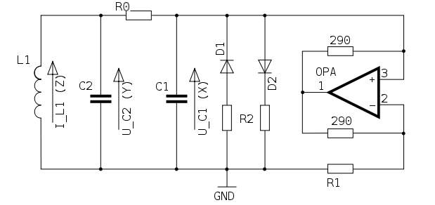

<!--
id:chuap
category:Signal Generators:Models and Emulations
-->
# chuap
Simulates Chua's oscillator, an LRC oscillator with an active resistor, proved capable of bifurcation and chaotic attractors, with k-rate control of circuit elements.

Plugin opcode in chua. This opcode is part of the plugin repository and has to be installed separately. The plugin repository can be found here: [https://github.com/csound/plugins](https://github.com/csound/plugins)

Simulates Chua's oscillator, an LRC oscillator with an active resistor, proved capable of bifurcation and chaotic attractors, with k-rate control of circuit elements.

## Syntax
``` csound-orc
aI3, aV2, aV1 chuap kL, kR0, kC2, kG, kGa, kGb, kE, kC1, iI3, iV2, iV1, ktime_step
```

### Initialization

_iI3_ -- Initial current at G

_iV2_ -- Initial voltage at C2

_iV1_ -- Initial voltage at C1

### Performance

_kL_ -- Inductor L (L1 in the diagram)

_kR0_ -- Resistor R0 (R0 in the diagram)

_kC1_ -- Capacitor C1

_kC2_ -- Capacitor C2

_kG_ -- Resistor G (part of the active resistor, R1 in the diagram). The G parameter is the time step, which is needed to get the same slope of the piecewise discontinuity from Ga and Gb for all sampling rates.

_kGa_ -- Resistor V (nonlinearity term of the active resistor, one of the R2's in the diagram)

_kGb_ -- Resistor V (nonlinearity term of the active resistor, one of the R2's in the diagram)

_kE_ -- Size of the piecewise discontinuity simulating the active resistor

_ktime_step_ -- Delta time in the difference equation, can be used to more or less control pitch.

_Chua's oscillator_ is a simple LRC oscillator with an active resistor. The oscillator can be driven into period bifurcation, and thus to chaos, because of the nonlinear response of the active resistor.

<figure markdown="span">

<figcaption>Diagram of Chua's Oscillator Circuit</figcaption>
</figure>

The circuit is described by a set of three ordinary differential equations called Chua's equations:

```
dI3      R0      1
--- =  - -- I3 - - V2
dt       L       L

dV2    1       G
--- = -- I3 - -- (V2 - V1)
dt    C2      C2

dV1    G              1
--- = -- (V2 - V1) - -- f(V1)
dt    C1             C1
```

where f() is a piecewise discontinuity simulating the active resistor:

```
f(V1) = Gb V1 + - (Ga - Gb)(|V1 + E| - |V1 - E|)
```

A solution of these equations (I3,V2,V1)(t) starting from an initial state (I3,V2,V1)(0) is called a trajectory of Chua's oscillator. The Csound implementation is a difference equation simulation of Chua's oscillator with Runge-Kutta integration.

> :memo: **Note**
>
> This algorithm uses internal non linear feedback loops which causes audio result to depend on the orchestra sampling rate. For example, if you develop a project with _sr_=48000Hz and if you want to produce an audio CD from it, you should record a file with _sr_=48000Hz and then downsample the file to 44100Hz using the [src_conv](../../utility/src_conv) utility.

> :warning: **Warning**
> 
> Be careful! Some sets of parameters will produce amplitude spikes or positive feedback that could damage your speakers.

## Examples

Here is an example of the chuap opcode. It uses the file [chuap.csd](../../examples/chuap.csd).

``` csound-orc title="Example of the chuap opcode." linenums="1"
--8<-- "examples/chuap.csd"
```

## See Also

[Models and Emulations](../../siggen/models)

## Credits

Inventor of Chua's oscillator: [Leon O. Chua](http://www.eecs.berkeley.edu/~chua)<br>
Author of MATLAB simulation: James Patrick McEvoy [MATLAB Adventures in Bifurcations and Chaos (ABC++)](http://www.mathworks.com/matlabcentral/fileexchange/loadFile.do?objectId=3541)<br>
Author of Csound port: Michael Gogins<br>

New in Csound version 5.09

Note added by François Pinot, August 2009
