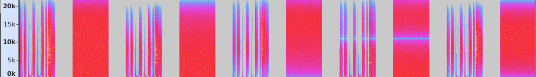

<!--
id:delay1
category:Signal Modifiers:Delay
-->
# delay1
Delays an input signal by one sample.

## Syntax
``` csound-orc
ares delay1 asig [, iskip]
```

### Initialization

_iskip_ (optional, default=0) -- initial disposition of delay-loop data space (see [reson](../../opcodes/reson)). The default value is 0.

### Performance

_delay1_ is a special form of delay that serves to delay the audio signal _asig_ by just one sample. It is thus functionally equivalent to the [delay](../../opcodes/delay) opcode but is more efficient in both time and space. This unit is particularly useful in the fabrication of generalized non-recursive filters.

## Examples

Here is an example of the delay and delay1 opcodes. It uses the file [delay1.csd](../../examples/delay1.csd).

``` csound-csd title="Example of the delay1 opcode." linenums="1"
--8<-- "examples/delay1.csd"
```

This shows the result of the example: 5 times the beats and the noise. 1.Original samples, 2.first-order lowpass, 3.first-order highpass, 4.second-order notch and 5.second-order bandpass.

<figure markdown="span">

<figcaption></figcaption>
</figure>

## See also

[Delay](../../sigmod/delayops)

## Credits

Author: Barry Vercoe
