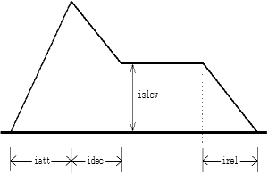

<!--
id:madsr
category:Signal Generators:Envelope Generators
-->
# madsr
Calculates the classical ADSR envelope using the [linsegr](../../opcodes/linsegr) mechanism.

## Syntax
``` csound-orc
ares madsr iatt, idec, islev, irel [, idel] [, ireltim]
kres madsr iatt, idec, islev, irel [, idel] [, ireltim]
```

### Initialization

_iatt_ -- duration of attack phase

_idec_ -- duration of decay

_islev_ -- level for sustain phase

_irel_ -- duration of release phase.

_idel_ -- period of zero before the envelope starts

_ireltim_ (optional, default=-1) -- Control release time after receiving a MIDI noteoff event. If less than zero, the longest release time given in the current instrument is used. If zero or more, the given value will be used for release time. Its default value is -1. (New in Csound 3.59 - not yet properly tested)

Please note that the release time was restricted to 32767/[kr](../../opcodes/kr) seconds in versions prior to 5.00; since then it has been (2<sup>31</sup>-1)/kr.

### Performance

The envelope is in the range 0 to 1 and may need to be scaled further. The envelope may be described as:

<figure markdown="span">

<figcaption>Picture of an ADSR envelope.</figcaption>
</figure>

The length of the sustain is calculated from the length of the note. This means [adsr](../../opcodes/adsr) is not suitable for use with MIDI events. The opcode _madsr_ uses the [linsegr](../../opcodes/linsegr) mechanism, and so can be used in MIDI applications.

You can use other pre-made envelopes which start a release
segment upon receiving a note off message, like [linsegr](../../opcodes/linsegr) and [expsegr](../../opcodes/expsegr), or you can construct more complex envelopes using [xtratim](../../opcodes/xtratim) and [release](../../opcodes/release). Note that you do not need to use [xtratim](../../opcodes/xtratim) if you are using _madsr_, since the time is extended automatically.

> :memo: **Note**
>
> Times for _iatt_, _idec_ and _irel_ cannot be 0. If 0 is used, no envelope is generated. Use a very small value like 0.0001 if you need an instantaneous attack, decay or release.

## Examples

Here is an example of the madsr opcode. It uses the file [madsr.csd](../../examples/madsr.csd).

``` csound-csd title="Example of the madsr opcode." linenums="1"
--8<-- "examples/madsr.csd"
```

Here is another example of the madsr opcode, using midi input. It uses the file [madsr-2.csd](../../examples/madsr-2.csd).

``` csound-csd title="second example of the madsr opcode." linenums="1"
--8<-- "examples/madsr-2.csd"
```

Here is an example for the adsr-group, comparing the different adsr opcodes. It uses the file [adsr-group.csd](../../examples/adsr-group.csd).

``` csound-csd title="Example of the adsr group." linenums="1"
--8<-- "examples/adsr-group.csd"
```

## See Also

[Envelope Generators](../../siggen/envelope)

## Credits

Author: John ffitch

November 2002. Thanks to Rasmus Ekman, added documentation for the _ireltim_ parameter.

December 2002. Thanks to Iain McCurdy, added an example.

December 2002. Thanks to Istvan Varga, added documentation about the maximum release time.

New in Csound version 3.49.
