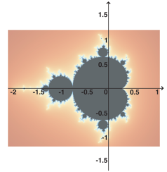

<!--
id:mandel
category:Signal Generators:Models and Emulations
-->
# mandel
Mandelbrot set

Returns the number of iterations corresponding to a given point of complex plane by applying the Mandelbrot set formula.

## Syntax
``` csound-orc
kiter, koutrig mandel  ktrig, kx, ky, kmaxIter
```

### Performance

_kiter_ - number of iterations

_koutrig_ - output trigger signal

_ktrig_ - input trigger signal

_kx, ky_ - coordinates of a given point belonging to the complex plane

_kmaxIter_ - maximum iterations allowed

_mandel_ is an opcode that allows the use of the Mandelbrot set formula to generate an output that can be applied to any musical (or non-musical) parameter. It has two output arguments: _kiter_, that contains the iteration number of a given point, and _koutrig_, that generates a trigger 'bang' each time _kiter_ changes. A new number of iterations is evaluated only when _ktrig_ is set to a non-zero value. The coordinates of the complex plane are set in _kx_ and _ky_, while _kmaxIter_ contains the maximum number of iterations. Output values, which are integer numbers, can be mapped in any sorts of ways by the composer.

<figure markdown="span">

<figcaption></figcaption>
</figure>

## Examples

Here is an example of the mandel opcode. It uses the file [mandel.csd](../../examples/mandel.csd).

``` csound-orc title="Example of the mandel opcode." linenums="1"
--8<-- "examples/mandel.csd"
```

Two musical examples featuring the mandel opcode: [Mandel_Daughtrey.csd](../../examples/musical/Mandel_Daughtrey.csd) by Scott Daughtrey, and [Mandel_Gogins.csd](../../examples/musical/Mandel_Gogins.csd) by Michael Gogins.

## See Also

[Models and Emulations](../../siggen/models)

## Credits

Written by Gabriel Maldonado.

New in Csound 5 (Previously available only on CsoundAV)
