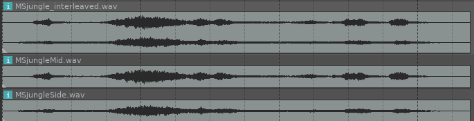

<!--
id:ms2st
category:Signal Modifiers:Panning and Spatialization
-->
# ms2st
Mid-Side to stereo Conversion with a width control.

It is a pure function with no side effects.

The ms2st opcode decodes the MS stereo signal, but it also opens up the possibility to adjust the stereo width for _every_ stereo sound; A stereo file can be encoded, using the st2ms opcode, and then decoded by ms2st. It is then possible to adjust the stereo width.

## Syntax
``` csound-orc
aleft,aright ms2st am, as, kwidth
```

### Performance

_aleft_ -- left channel output.

_aright_ -- right channel output.

_am_ -- mid signal input.

_as_ -- side signal input.

_kwidth_ -- stereo width (0 to 1). At 0, no side signal is output, and at 1 no mid signal is present. A value of 0.5 restores a stereo to MS conversion (st2ms) exactly.

## Examples

Here is an example of the ms2st opcode. It uses the files [ms2st.csd](../../examples/ms2st.csd), [MSjungle_interleaved.wav](../../examples/MSjungle_interleaved.wav), [MSjungleMid.wav](../../examples/MSjungleMid.wav) and [MSjungleSide.wav](../../examples/MSjungleSide.wav).

``` csound-csd title="Example of the ms2st opcode." linenums="1"
--8<-- "examples/ms2st.csd"
```

In instr 1 of the example, the encoded MS stereo file is interleaved. The left channel of this interleaved signal will be decoded as the M (=Mid) signal. The right channel will be decoded as Left and Right. In instr 2 however, two separate channels are used. The user decides which one will be appointed as the middle signal (M) and the side signal (S).

<figure markdown="span">

<figcaption>on top the interleaved encoded MS file (instr 1), at the bottom are the two separate files (instr 2)</figcaption>
</figure>

## See also

[Panning and Spatialization: Amplitude spatialization](../../sigmod/panspatl)

## Credits

Author: Victor Lazzarini<br>
April 2021<br>
