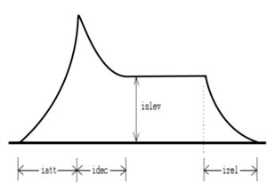

<!--
id:mxadsr
category:Signal Generators:Envelope Generators
-->
# mxadsr
Calculates the classical ADSR envelope using the [expsegr](../../opcodes/expsegr) mechanism.

## Syntax
``` csound-orc
ares mxadsr iatt, idec, islev, irel [, idel] [, ireltim]
kres mxadsr iatt, idec, islev, irel [, idel] [, ireltim]
```

### Initialization

_iatt_ -- duration of attack phase

_idec_ -- duration of decay

_islev_ -- level for sustain phase

_irel_ -- duration of release phase

_idel_ (optional, default=0) -- period of zero before the envelope starts

_ireltim_ (optional, default=-1) -- Control release time after receiving a MIDI noteoff event. If less than zero, the longest release time given in the current instrument is used. If zero or more, the given value will be used for release time. Its default value is -1. (New in Csound 3.59 - not yet properly tested)

### Performance

The envelope is in the range 0 to 1 and may need to be scaled further. The envelope may be described as:

<figure markdown="span">

<figcaption>Picture of an exponential ADSR envelope.</figcaption>
</figure>

The length of the sustain is calculated from the length of the note. This means _adsr_ is not suitable for use with MIDI events. The opcode [madsr](../../opcodes/madsr) uses the [linsegr](../../opcodes/linsegr) mechanism, and so can be used in MIDI applications. The opcode _mxadsr_ is identical to [madsr](../../opcodes/madsr) except it uses exponential, rather than linear, line segments.

You can use other pre-made envelopes which start a release segment upon receiving a note off message, like [linsegr](../../opcodes/linsegr) and [expsegr](../../opcodes/expsegr), or you can construct more complex envelopes using [xtratim](../../opcodes/xtratim) and [release](../../opcodes/release). Note that you do not need to use [xtratim](../../opcodes/xtratim) if you are using _mxadsr_, since the time is extended automatically.

_mxadsr_ is new in Csound version 3.51.

## Examples

Here is an example of the mxadsr opcode. It uses the file [mxadsr.csd](../../examples/mxadsr.csd).

``` csound-csd title="Example of the mxadsr opcode." linenums="1"
--8<-- "examples/mxadsr.csd"
```

Here is an example for the adsr-group, comparing the different adsr opcodes. It uses the file [adsr-group.csd](../../examples/adsr-group.csd).

``` csound-csd title="Example of the adsr group." linenums="1"
--8<-- "examples/adsr-group.csd"
```

## See Also

[Envelope Generators](../../siggen/envelope)

## Credits

Author: John ffitch

November 2002. Thanks to Rasmus Ekman, added documentation for the _ireltim_ parameter.

November 2003. Thanks to Kanata Motohashi, fixed the link to the _linsegr_ opcode.
