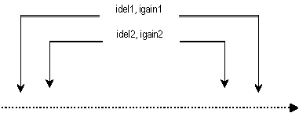

<!--
id:nestedap
category:Signal Modifiers:Reverberation
-->
# nestedap
Three different nested all-pass filters, useful for implementing reverbs.

## Syntax
``` csound-orc
ares nestedap asig, imode, imaxdel, idel1, igain1 [, idel2] [, igain2] \
              [, idel3] [, igain3] [, istor]
```

### Initialization

_imode_ -- operating mode of the filter:

*  1 = simple all-pass filter
*  2 = single nested all-pass filter
*  3 = double nested all-pass filter

_idel1_, _idel2_, _idel3_ -- delay times of the filter stages. Delay times are in seconds and must be greater than zero. _idel1_ must be greater than the sum of _idel2_ and _idel3_.

_igain1_, _igain2_, _igain3_ -- gain of the filter stages.

_imaxdel_ -- will be necessary if k-rate delays are implemented. Not currently used.

_istor_ -- Skip initialization if non-zero (default: 0).

### Performance

_asig_ -- input signal

If _imode_ = 1, the filter takes the form:

<figure markdown="span">

<figcaption>Picture of imode 1 filter.</figcaption>
</figure>

If _imode_ = 2, the filter takes the form:

<figure markdown="span">

<figcaption>Picture of imode 2 filter.</figcaption>
</figure>

If _imode_ = 3, the filter takes the form:

<figure markdown="span">

<figcaption>Picture of imode 3 filter.</figcaption>
</figure>

## Examples

Here is an example of the nestedap opcode. It uses the file [nestedap.csd](../../examples/nestedap.csd), and [drumsMlp.wav](../../examples/drumsMlp.wav).

``` csound-csd title="Example of the nestedap opcode." linenums="1"
--8<-- "examples/nestedap.csd"
```

## See also

[Reverberation](../../sigmod/reverbtn)

## Credits

Author: Hans Mikelson<br>
February 1999<br>

New in Csound version 3.53

The example was updated May 2002, thanks to Hans Mikelson
