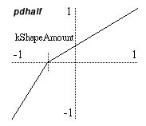

<!--
id:pdhalf
category:Signal Modifiers:Waveshaping
-->
# pdhalf
Distorts a phasor for reading the two halves of a table at different rates.

The _pdhalf_ opcode is designed to emulate the "classic" phase distortion synthesis method of the Casio CZ-series of synthesizers from the mid-1980's.  This technique reads the first and second halves of a function table at different rates in order to warp the waveform.  For example, _pdhalf_ can smoothly transform a sine wave into something approximating the shape of a saw wave.

## Syntax
``` csound-orc
aout pdhalf ain, kShapeAmount [, ibipolar [, ifullscale]]
```

### Initialization

_ibipolar_ -- an optional parameter specifying either unipolar (0) or bipolar (1) mode.  Defaults to unipolar mode.

_ifullscale_ -- an optional parameter specifying the range of input and output values. The maximum will be _ifullscale_. The minimum depends on the mode of operation: zero for unipolar or -_ifullscale_ for bipolar.  Defaults to 1.0 -- you should set this parameter to the maximum expected input value.

### Performance

_ain_ --  the input signal to be distorted.

_aout_ --  the output signal.

_kShapeAmount_ --  the amount of distortion applied to the input.  Must be between negative one and one (-1 to 1). An amount of zero means no distortion.

<figure markdown="span">

<figcaption>Transfer function created by pdhalf and a negative kShapeAmount.</figcaption>
</figure>

The _pdhalf_ opcode calculates a transfer function that is composed of two linear segments (see the graph).  These segments meet at a "pivot point" which always lies on the same horizontal axis.  (In unipolar mode, the axis is y = 0.5, and for bipolar mode it is the x axis).  The _kShapeAmount_ parameter specifies where on the horizontal axis this point falls.  When _kShapeAmount_ is zero, the pivot point is in the middle of the input range, forming a straight line for the transfer function and thus causing no change in the input signal.  As _kShapeAmount_ changes from zero (0) to negative one (-1), the pivot point moves towards the left side of the graph, producing a phase distortion pattern like the Casio CZ's "sawtooth waveform".  As it changes from zero (0) to positive one (1), the pivot point moves toward the right, producing an inverted pattern.

If the input to _pdhalf_ is a phasor and the output is used to index a table, values for _kShapeAmount_ that are less than zero will cause the first half of the table to be read more quickly than the second half.  The reverse is true for values of _kShapeAmount_ greater than zero. The rates at which the halves are read are calculated so that the frequency of the phasor is unchanged.  Thus, this method of phase distortion can only produce higher partials in a harmonic series.  It cannot produce inharmonic sidebands in the way that frequency modulation does.

_pdhalf_ can work in either unipolar or bipolar modes. Unipolar mode is appropriate for signals like phasors that range between zero and some maximum value (selectable with _ifullscale_). Bipolar mode is appropriate for signals that range above and below zero by roughly equal amounts such as most audio signals.  Applying _pdhalf_ directly to an audio signal in this way results in a crude but adjustable sort of waveshaping/distortion.

## Examples

A typical example of the use of pdhalf is

``` csound-orc
aphase    phasor    ifreq
apd       pdhalf    aphase, kamount
aout      tablei    apd, 1, 1
```

Here is an example of the pdhalf opcode. It uses the file [pdhalf.csd](../../examples/pdhalf.csd).

``` csound-csd title="Example of the pdhalf opcode." linenums="1"
--8<-- "examples/pdhalf.csd"
```

## See also

[Phase Distortion](../../sigmod/wavshape)

More information about phase distortion on Wikipedia: [http://en.wikipedia.org/wiki/Phase_distortion_synthesis](http://en.wikipedia.org/wiki/Phase_distortion_synthesis)

## Credits

Author: Anthony Kozar<br>
January 2008<br>

New in Csound version 5.08
