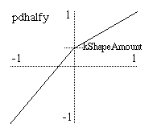

<!--
id:pdhalfy
category:Signal Modifiers:Waveshaping
-->
# pdhalfy
Distorts a phasor for reading two unequal portions of a table in equal periods.

The _pdhalfy_ opcode is a variation on the phase distortion synthesis method of the [pdhalf](../../opcodes/pdhalf) opcode.  It is useful for distorting a phasor in order to read two unequal portions of a table in the same number of samples.

## Syntax
``` csound-orc
aout pdhalfy ain, kShapeAmount [, ibipolar [, ifullscale]]
```

### Initialization

_ibipolar_ -- an optional parameter specifying either unipolar (0) or bipolar (1) mode.  Defaults to unipolar mode.

_ifullscale_ -- an optional parameter specifying the range of input and output values. The maximum will be _ifullscale_. The minimum depends on the mode of operation: zero for unipolar or -_ifullscale_ for bipolar.  Defaults to 1.0 -- you should set this parameter to the maximum expected input value.

### Performance

_ain_ --  the input signal to be distorted.

_aout_ --  the output signal.

_kShapeAmount_ --  the amount of distortion applied to the input.  Must be between negative one and one (-1 to 1). An amount of zero means no distortion.

<figure markdown="span">

<figcaption>Transfer function created by pdhalfy and a negative kShapeAmount.</figcaption>
</figure>

The _pdhalfy_ opcode calculates a transfer function that is composed of two linear segments (see the graph).  These segments meet at a "pivot point" which always lies on the same vertical axis.  (In unipolar mode, the axis is x = 0.5, and for bipolar mode it is the y axis).  So, _pdhalfy_ is a variation of the [pdhalf](../../opcodes/pdhalf) opcode that places the pivot point of the phase distortion pattern on a vertical axis instead of a horizontal axis.

The _kShapeAmount_ parameter specifies where on the vertical axis this point falls.  When _kShapeAmount_ is zero, the pivot point is in the middle of the output range, forming a straight line for the transfer function and thus causing no change in the input signal.  As _kShapeAmount_ changes from zero (0) to negative one (-1), the pivot point downward towards the bottom of the graph.  As it changes from zero (0) to positive one (1), the pivot point moves upward, producing an inverted pattern.

If the input to _pdhalfy_ is a phasor and the output is used to index a table, the use of _pdhalfy_ will divide the table into two segments of different sizes with each segment being mapped to half of the oscillator period.  Values for _kShapeAmount_ that are less than zero will cause less than half of the table to be read in the first half of the period of oscillation.  The rest of the table will be read in the second half of the period.  The reverse is true for values of _kShapeAmount_ greater than zero. Note that the frequency of the phasor is always unchanged.  Thus, this method of phase distortion can only produce higher partials in a harmonic series.  It cannot produce inharmonic sidebands in the way that frequency modulation does. _pdhalfy_ tends to have a milder quality to its distortion than _pdhalf_.

_pdhalfy_ can work in either unipolar or bipolar modes. Unipolar mode is appropriate for signals like phasors that range between zero and some maximum value (selectable with _ifullscale_). Bipolar mode is appropriate for signals that range above and below zero by roughly equal amounts such as most audio signals.  Applying _pdhalfy_ directly to an audio signal in this way results in a crude but adjustable sort of waveshaping/distortion.

## Examples

A typical example of the use of pdhalfy is

``` csound-orc
aphase    phasor     ifreq
apd       pdhalfy    aphase, kamount
aout      tablei     apd, 1, 1
```

Here is an example of the pdhalfy opcode. It uses the file [pdhalfy.csd](../../examples/pdhalfy.csd).

``` csound-csd title="Example of the pdhalfy opcode." linenums="1"
--8<-- "examples/pdhalfy.csd"
```

## See also

[Phase Distortion](../../sigmod/wavshape)

More information about phase distortion on Wikipedia: [http://en.wikipedia.org/wiki/Phase_distortion_synthesis](http://en.wikipedia.org/wiki/Phase_distortion_synthesis)

## Credits

Author: Anthony Kozar<br>
January 2008<br>

New in Csound version 5.08
