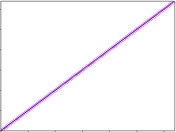
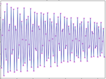

<!--
id:scans
category:Signal Generators:Scanned Synthesis
-->
# scans
Generate audio output using scanned synthesis.

Plugin opcode in scansyn.

## Syntax
``` csound-orc
ares scans kamp, kfreq, ifn, id [, iorder]
```

### Initialization

_ifn_ -- ftable containing the scanning trajectory.  This is a series of numbers that contains addresses of masses.  The order of these addresses is used as the scan path.  It should not contain values greater than the number of masses, or negative numbers. See the [introduction to the scanned synthesis section](../../siggen/scantop).

_id_ -- ID number of the [scanu](../../opcodes/scanu) opcode's waveform to use

_iorder_ (optional, default=0) -- order of interpolation used internally.  It can take any value in the range 1 to 4, and defaults to 4 if outside that range, which is quartic interpolation.  The setting of 3 is cubic, 2 is quadratic and 1 is linear.  The higher numbers are slower, but not necessarily better.

### Performance

_kamp_ -- output amplitude.  Note that the resulting amplitude is also dependent on instantaneous value in the wavetable.  This number is effectively the scaling factor of the wavetable.

_kfreq_ -- frequency of the scan rate

## Examples

Here is an example of the scanned synthesis. It uses the file [scans.csd](../../examples/scans.csd).

``` csound-csd title="Example of the scans opcode." linenums="1"
--8<-- "examples/scans.csd"
```

Here is another example of the scanned synthesis. It uses the file [scans-2.csd](../../examples/scans-2.csd).

``` csound-csd title="Second example of the scans opcode." linenums="1"
--8<-- "examples/scans-2.csd"
```

A plot of the table `itraj1  ftgenonce 6, 0, 128, -7, 0, 128, 128` and `itraj2  ftgenonce 66, 0, 128, -23, "straightline_max128_128.traj"`:

<figure markdown="span">

<figcaption></figcaption>
</figure>

and this is what the table `itraj3  ftgenonce 666, 0, 128, -23, "128-spiral-8,16,128,2,1over2.traj` looks like:

<figure markdown="span">

<figcaption></figcaption>
</figure>

## See also

[Scanned Synthesis](../../siggen/scantop)

More information on the Scanned Synthesis opcodes: [Working with Scanned Synthesis](http://www.csounds.com/stevenyi/scanned/yi_scannedSynthesis.html), written by Steven Yi, and some [tutorials](http://www.csounds.com/scanned/) by Richard Boulanger.

## Credits

Author: Paris Smaragdis<br>
MIT Media Lab<br>
Boston, Massachussetts USA<br>

New in Csound version 4.05
