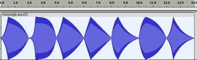

<!--
id:transegb
category:Signal Generators:Linear and Exponential Generators
-->
# transegb
Constructs a user-definable envelope in absolute time.

## Syntax
```csound-orc
ares transegb ia, itim, itype, ib [, itim2] [, itype] [, ic] ...
kres transegb ia, itim, itype, ib [, itim2] [, itype] [, ic] ...
```

### Initialization
_ia_ -- starting value.

_ib, ic,_ etc. -- value after _itim_ seconds.

_itim_ -- time in seconds of end of first segment.

_itim2,... itimx_ etc. -- time in seconds at the end of the segment.

_itype, itype2,_ etc. -- if 0, a straight line is produced. If non-zero, then _transegb_ creates the following curve, for _n_ steps:

```
ibeg + (ivalue - ibeg) * (1 - exp( i*itype/(n-1) )) / (1 - exp(itype))
```

### Performance
If _itype_ > 0, there is a slowly rising (concave) or slowly decaying (convex) curve, while if _itype_ < 0, the curve is fast rising (convex) or fast decaying (concave). See also [GEN16](../../scoregens/gen16).

## Examples
Here is an example of the transegb opcode. It uses the file [transegb.csd](../../examples/transegb.csd). The example produces the following output:

<figure markdown="span">
  
  <figcaption>Output of the transegb example.</figcaption>
</figure>

``` csound-orc title="Example of the transegb opcode." linenums="1"
--8<-- "examples/transegb.csd"
```

## See also
[Linear and Exponential Generators](../../siggen/lineexp)

## Credits
Author: John ffitch  
University of Bath, Codemist. Ltd.  
Bath, UK  
June 2011

New in Csound version 5.14
