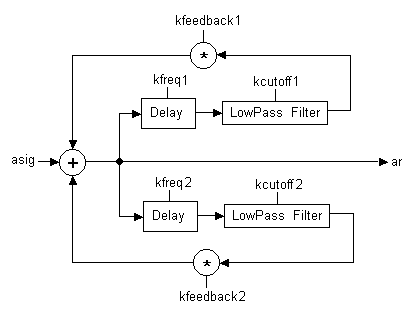

<!--
id:wguide2
category:Signal Modifiers:Waveguides
-->
# wguide2
A model of beaten plate consisting of two parallel delay-lines and two first-order lowpass filters.

## Syntax
``` csound-orc
ares wguide2 asig, xfreq1, xfreq2, kcutoff1, kcutoff2, kfeedback1, kfeedback2
```

### Performance

_asig_ -- the input of excitation noise

_xfreq1, xfreq2_ -- the frequency (i.e. the inverse of delay time) Changed to x-rate in Csound version 3.59.

_kcutoff1, kcutoff2_ -- the filter cutoff frequency in Hz.

_kfeedback1, kfeedback2_ -- the feedback factor

_wguide2_ is a model of beaten plate consisting of two parallel delay-lines and two first-order lowpass filters. The two feedback lines are mixed and sent to the delay again each cycle.

Implementing waveguide algorithms as opcodes, instead of orc instruments, allows the user to set _kr_ different than _sr_, allowing better performance particulary when using real-time.

<figure markdown="span">

<figcaption>wguide2.</figcaption>
</figure>

> :memo: **Note**
>
> As a rule of thumb, to avoid making _wguide2_ unstable, the sum of the two feedback values should be below 0.5.

## Examples

Here is an example of the wguide2 opcode. It uses the file [wguide2.csd](../../examples/wguide2.csd).

``` csound-csd title="Example of the wguide2 opcode." linenums="1"
--8<-- "examples/wguide2.csd"
```

## See also

[Waveguide Physical Modeling](../../siggen/wavguide)

[Waveguides](../../sigmod/wavguide)

## Credits

Author: Gabriel Maldonado<br>
Italy<br>
October 1998<br>

New in Csound version 3.49
