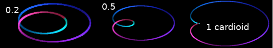
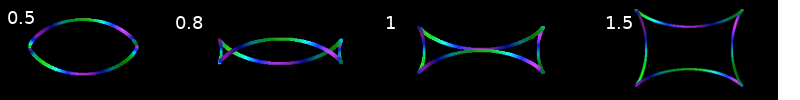

<!--
id:wterrain2
category:Signal Generators:Wave Terrain Synthesis
-->
# wterrain2
A wave-terrain synthesis opcode using different curves

It enhances the [wterrain](../../opcodes/wterrain) opcode by providing some more curves, krate table parameters and a parameter for rotating the curve.

## Syntax
``` csound-orc
aout wterrain2 kamp, kcps, kx, ky, krx, kry, krot, ktab0, ktab1, \
               kcurve, kcurveparam

```

### Performance

_ktabx, ktaby_ -- The two tables that define the terrain - they can be changed at krate.

The output is the result of traversing at frequency _kcps_ the curve _kcurve_ with the parameter _kcurveparam_ (see below), scaled with _krx_ and _kry_ and centered at _kx_, _ky_ on the terrain and rotated around the center with _krot_ radians.

_kcurve=0: ellipse_ as in the wterrain opcode but with a special extension. kcurveparam controls a speed change of the traversing point. The formula is:

```
fx(t) = kx + krx * sin( t + kcurveparam * sin(t) )
fy(t) = ky + kry * cos( t + kcurveparam * sin(t) )
```

_kcurve=1: lemniskate_ - this is a simple 8. here also the kcurveparam controls a speed change of the traversing point. The formula is:

```
fx(t) = kx + krx * cos( t + kcurveparam * sin(t) )
fy(t) = ky + kry * sin( t + kcurveparam * sin(t) )  * cos( t + kcurveparam * sin(t) )
```

_kcurve=2: limacon_

```
fx(t) = kx + krx * sin(t) * (cos(t) + kcurveparam);
fy(t) = ky + kry * cos(t) * (cos(t) + kcurveparam);
```

<figure markdown="span">

<figcaption>limacon curve with different parameters</figcaption>
</figure>

_kcurve=3: cornoid_

```
fx(t) = kx + krx * cos(t) * cos(2*t)
fy(t) = ky + kry * sin(t) * (kcurveparam + cos(2*t))
```

<figure markdown="span">

<figcaption>cornoid with different parameters</figcaption>
</figure>

_kcurve=4: trisectrix (Ceva)_

```
fx(t) = kx + krx * cos(t) * (1+kcurveparam*sin(2*t));
fy(t) = ky + kry * sin(t) * (1+kcurveparam*sin(2*t));
```

<figure markdown="span">

<figcaption>trisectrix curve with different parameters</figcaption>
</figure>

_kcurve=5: scarabeus_

```
fx(t) = kx + krx * cos(t) * (1+kcurveparam*sin(2*t));
fy(t) = ky + kry * sin(t) * (1+kcurveparam*sin(2*t));
```

<figure markdown="span">

<figcaption>scarabeus curve with different parameters</figcaption>
</figure>

_kcurve=6: folium_

```
fx(t) = kx + krx * cos(t) * cos(t) * (sin(t)*sin(t) - kcurveparam);
fy(t) = ky + kry * sin(t) * cos(t) * (sin(t)*sin(t) - kcurveparam);
```

<figure markdown="span">

<figcaption>folium with different parameters</figcaption>
</figure>

_kcurve=7: Talbot curve_

```
fx(t) = kx + krx * cos(t) * (1 + kcurveparam * sin(t)*sin(t));
fy(t) = ky + kry * sin(t) * (1 - kcurveparam - kcurveparam*cos(t)*cos(t));
```

<figure markdown="span">

<figcaption>Talbot curve with different parameters</figcaption>
</figure>

## Examples

Here is an example of the wterrain2 opcode. It uses the file
[wterrain2_1.csd](../../examples/wterrain2_1.csd).

``` csound-csd title="Example of the wterrain2 opcode." linenums="1"
--8<-- "examples/wterrain2_1.csd"
```

Here is an other example of the wterrain2 - a sound fugue.
It uses the file [wterrain2_2.csd](../../examples/wterrain2_2.csd).

``` csound-csd title="Another Example of the wterrain2 opcode - a sound fugue" linenums="1"
--8<-- "examples/wterrain2_2.csd"
```

## See Also

[Wave Terrain Synthesis](../../siggen/waveterr)

## Credits

Author: Christian Bacher<br>
New in version 6.15<br>
