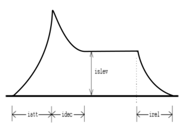

<!--
id:xadsr
category:Signal Generators:Envelope Generators
-->
# xadsr
Calculates the classical ADSR envelope.

## Syntax
``` csound-orc
ares xadsr iatt, idec, islev, irel [, idel]
kres xadsr iatt, idec, islev, irel [, idel]
```

### Initialization

_iatt_ -- duration of attack phase

_idec_ -- duration of decay

_islev_ -- level for sustain phase

_irel_ -- duration of release phase

_idel_ -- period of zero before the envelope starts

### Performance

The envelope generated is the range 0 to 1 and may need to be scaled further, depending on the amplitude required. If using [0dbfs](../../opcodes/0dbfs) = 1, scaling down will probably be required since playing more than one note might result in clipping. If not using [0dbfs](../../opcodes/0dbfs), scaling to a large amplitude (e.g. 32000) might be required.

The envelope may be described as:

<figure markdown="span">

<figcaption>Picture of an exponential ADSR envelope.</figcaption>
</figure>

The length of the sustain is calculated from the length of the note. This means _xadsr_ is not suitable for use with MIDI events, use [mxadsr](../../opcodes/mxadsr) instead. The opcode _xadsr_ is identical to [adsr](../../opcodes/adsr) except it uses exponential, rather than linear, line segments.

## Examples

Here is an example of the xadsr opcode. It uses the file [xadsr.csd](../../examples/xadsr.csd).

``` csound-csd title="Example of the xadsr opcode." linenums="1"
--8<-- "examples/xadsr.csd"
```

Here is an example for the adsr-group, comparing the different adsr opcodes. It uses the file [adsr-group.csd](../../examples/adsr-group.csd).

``` csound-csd title="Example of the adsr group." linenums="1"
--8<-- "examples/adsr-group.csd"
```

## See Also

[Envelope Generators](../../siggen/envelope)

## Credits

Author: John ffitch
_xadsr_ is new in Csound version 3.51.
