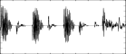

<!--
id:GEN01
category:
-->
# GEN01
Transfers data from a soundfile into a function table.

## Syntax
``` csound-orc
f#  time  size  1  filcod  skiptime  format  channel
```

### Performance

_size_ -- number of points in the table. Ordinarily a power of 2 or a power-of-2 plus 1 (see [f statement](../../scoregens/f)); the maximum tablesize is 16777216 (2<sup>24</sup>) points. The allocation of table memory can be _deferred_ by setting this parameter to 0; the size allocated is then the number of points in the file (probably not a power-of-2), and the table is not usable by normal oscillators, but it is usable by a [loscil](../../opcodes/loscil) unit. The soundfile can also be mono or stereo.

_filcod_ -- integer or character-string denoting the source soundfile name. An integer denotes the file _soundin_._filcod_ ; a character-string (in double quotes, spaces permitted) gives the filename itself, optionally a full pathname. If not a full path, the file is sought first in the current directory, then in that given by the environment variable [SSDIR](../../command/environment) (if defined) then by [SFDIR](../../command/environment). See also [soundin](../../opcodes/soundin).

_skiptime_ -- begin reading at _skiptime_ seconds into the file.

_channel_ -- channel number to read in. 0 denotes read all channels.

_format_ -- if positive it is ignored, but if negative specifies the audio format of a raw file.

```
-1 - 8-bit signed character
-2 - 8-bit A-law bytes
-3 - 8-bit U-law bytes
-4 - 16-bit short integers
-5 - 32-bit long integers
-6 - 32-bit floats
-7 - 8-bit unsigned character
-8 - 24-bit integers
-9 - 64-bit doubles
```

> :memo: **Note**
>
> This list is not the same as in [diskin2](../../opcodes/diskin)

If _format_ = 0 the sample format is taken from the soundfile header.

> :memo: **Note**
>
> *   Reading stops at end-of-file or when the table is full. Table locations not filled will contain zeros.
> *   If p4 is positive, the table will be post-normalised (rescaled to a maximum absolute value of 1 after generation). A negative p4 will cause rescaling to be skipped.
> *   GEN01 also works with WAV and OGG and a dozen and more other sound formats; these file formats depend on libsndfile, see [http://www.mega-nerd.com/libsndfile/](http://www.mega-nerd.com/libsndfile/)

## Examples

Here is an example of the GEN01 routine. It uses the files [gen01.csd](../../examples/gen01.csd) and several sound files.

``` csound-csd title="An example of the GEN01 routine." linenums="1"
--8<-- "examples/gen01.csd"
```

These are the diagrams of the waveforms of the GEN01 routines, as used in the example:

<figure markdown="span">

<figcaption>f 1 0 131072 1 "drumsMlp.wav" 0 0 0 - non-deferred sound</figcaption>
</figure>

<figure markdown="span">

<figcaption>f 2 0 0 1 "flute.aiff" 0 0 0 - deferred sound</figcaption>
</figure>

<figure markdown="span">

<figcaption>f 3 0 0 1 "drumsMlp.ogg" 0 0 0 - deferred sound</figcaption>
</figure>

## Credits

September 2003. Thanks goes to Dr. Richard Boulanger for pointing out the references to the AIFF file format.

Revised in v6.11 and v6.12 to clarify status of headers and raw files, and to add three more sample formats.
