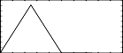
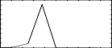

<!--
id:GEN02
category:
-->
# GEN02
Transfers data from immediate pfields into a function table.

## Syntax
``` csound-orc
f # time size 2 v1 v2 v3 ...
```

### Initialization

_size_ -- number of points in the table.

The maximum tablesize is 16777216 (2<sup>24</sup>) points. The value may be given as zero, in which case the number of values decides the table length.

_v1, v2, v3,_ etc. -- values to be copied directly into the table space. The values copied may include the table guard point; any table locations not filled will contain zeros.

> :memo: **Note**
>
> If p4 (the GEN routine number) is positive, the table will be post-normalized (rescaled to a maximum absolute value of 1 after generation). A negative p4 will cause rescaling to be skipped. You will usually want to use -2 with this GEN function, so that your values are not normalized.

## Examples

Here is an example of the GEN02 routine. It uses the files [gen02.csd](../../examples/gen02.csd).

``` csound-csd title="Example of the GEN02 routine." linenums="1"
--8<-- "examples/gen02.csd"
```

These are the diagrams of the waveforms of the GEN02 routines, as used in the example:

<figure markdown="span">

<figcaption>f 2 0 5 2 0 2 0</figcaption>
</figure>

<figure markdown="span">

<figcaption>f 3 0 5 2 0 2 10 0</figcaption>
</figure>

<figure markdown="span">

<figcaption>f 4 0 9 2 0 2 10 100 0</figcaption>
</figure>

## See Also

[GEN17](../../scoregens/gen17)

## Credits

December 2002. Thanks to Rasmus Ekman, corrected the limit of the _PMAX_ variable.

Use of length zero new in version 6.12
