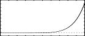

<!--
id:GEN03
category:
-->
# GEN03
Generates a stored function table by evaluating a polynomial in x over a fixed interval and with specified coefficients.

## Syntax
``` csound-orc
f  #  time  size  3  xval1  xval2  c0  c1  c2  ...  cn
```

### Initialization

_size_ -- number of points in the table. Must be a power of 2 or a power-of-2 plus 1.

_xval1, xval2_ -- left and right values of the x interval over which the polynomial is defined (_xval1_ &lt; _xval2_). These will produce the 1st stored value and the (power-of-2 plus l)th stored value respectively in the generated function table.

_c0, c1, c2, ..., cn_ -- coefficients of the nth-order polynomial

_C<sub>0</sub>_ + _C<sub>1</sub>x_ + _C<sub>2</sub>x<sup>2</sup>_ + . . . + _C<sub>n</sub>x<sup>n</sup>_

Coefficients may be positive or negative real numbers; a zero denotes a missing term in the polynomial. The coefficient list begins in p7, providing a current upper limit of 144 terms.

> :memo: **Note**
>
> * The defined segment [fn(_xval1_), fn(_xval2_)] is evenly distributed. Thus a 512-point table over the interval [-1,1] will have its origin at location 257 (at the start of the 2nd half). Provided the extended guard point is requested, both fn(-1) and fn(1) will exist in the table.
> * _GEN03_ is useful in conjunction with [table](../../opcodes/table) or [tablei](../../opcodes/tablei) for audio waveshaping (sound modification by non-linear distortion). Coefficients to produce a particular formant from a sinusoidal lookup index of known amplitude can be determined at preprocessing time using algorithms such as Chebyshev formulae. See also [GEN13](../../scoregens/gen13).

## Examples

Here is an example of the GEN03 generator. It uses the file [gen03.csd](../../examples/gen03.csd).

``` csound-csd title="Example of the GEN03 generator." linenums="1"
--8<-- "examples/gen03.csd"
```

These are the diagrams of the waveforms of the GEN03 routines, as used in the example:

<figure markdown="span">

<figcaption>f4 0 513 3 1 1 0 1 - first-order Chebyshev: x</figcaption>
</figure>

<figure markdown="span">

<figcaption>f6 0 513 3 -1 1 -1 0 2 - second-order Chebyshev: 2x2 - 1</figcaption>
</figure>

<figure markdown="span">

<figcaption>f8 0 513 3 -1 1 0 -3 0 4 - third-order Chebyshev: 4x3 - 3x</figcaption>
</figure>

<figure markdown="span">

<figcaption>f10 0 513 3 -1 10 0 -7 0 56 0 -112 0 64 - seventh-order Chebyshev: 64x7 - 112x5 + 56x3 - 7x</figcaption>
</figure>

<figure markdown="span">

<figcaption>f12 0 513 3 -1 1 5 4 3 2 2 1 - a 4th order polynomial function over the x-interval -1 to 1</figcaption>
</figure>

## See Also

[GEN13](../../scoregens/gen13), [GEN14](../../scoregens/gen14), and [GEN15](../../scoregens/gen15).

Information about the Chebyshev polynomials on Wikipedia: [http://en.wikipedia.org/wiki/Chebyshev_polynomials](http://en.wikipedia.org/wiki/Chebyshev_polynomials)
