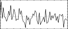
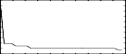
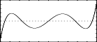
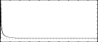

<!--
id:GEN04
category:
-->
# GEN04
Generates a normalizing function by examining the contents of an existing table.

## Syntax
``` csound-orc
f  #  time  size  4  source#  sourcemode
```

### Initialization

_size_ -- number of points in the table. Should be power-of-2 plus 1. Must not exceed (except by 1) the size of the source table being examined; limited to just half that size if the sourcemode is of type offset (see below).

_source #_ -- table number of stored function to be examined.

_sourcemode_ -- a coded value, specifying how the source table is to be scanned to obtain the normalizing function. Zero indicates that the source is to be scanned from left to right. Non-zero indicates that the source has a bipolar structure; scanning will begin at the mid-point and progress outwards, looking at pairs of points equidistant from the center.

> :memo: **Note**
>
> * The normalizing function derives from the progressive absolute maxima of the source table being scanned. The new table is created left-to-right, with stored values equal to 1/(absolute maximum so far scanned). Stored values will thus begin with 1/(first value scanned), then get progressively smaller as new maxima are encountered. For a source table which is normalized (values &lt;= 1), the derived values will range from 1/(first value scanned) down to 1. If the first value scanned is zero, that inverse will be set to 1.
> * The normalizing function from _GEN04_ is not itself normalized.
> * _GEN04_ is useful for scaling a table-derived signal so that it has a consistent peak amplitude. A particular application occurs in waveshaping when the carrier (or indexing) signal is less than full amplitude.

## Examples

Here is a simple example of the GEN04 routine. It uses the files [gen04.csd](../../examples/gen04.csd).

``` csound-csd title="An example of the GEN04 routine." linenums="1"
--8<-- "examples/gen04.csd"
```

These are the diagrams of the waveforms of the GEN04 routines, as used in the example:

<figure markdown="span">

<figcaption>f1 0 64 21 6 - Gaussian (random) distribution</figcaption>
</figure>

<figure markdown="span">

<figcaption>f2 0 33 4 1 1 - AND its normalizing function with midpoint bipolar offset</figcaption>
</figure>

<figure markdown="span">

<figcaption>f3 0 1025 13 1 1 0 5 0 5 0 10 - Chebyshev algorithm</figcaption>
</figure>

<figure markdown="span">

<figcaption>f4 0 513 4 3 1 - AND its normalizing function with midpoint bipolar offset</figcaption>
</figure>
