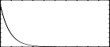

<!--
id:GEN05
category:
-->
# GEN05
Constructs functions from segments of exponential curves.

## Syntax
``` csound-orc
f # time size 5 a n1 b n2 c ...
```

### Initialization

_size_ -- number of points in the table. Must be a power of 2 or power-of-2 plus 1 (see [f statement](../../scoregens/f)).

_a, b, c,_ etc. -- ordinate values, in odd-numbered pfields p5, p7, p9, . . . These must be nonzero and must be alike in sign.

_n1, n2_, etc. -- length of segment (no. of storage locations), in even-numbered pfields. Cannot be negative, but a zero is meaningful for specifying discontinuous waveforms. The sum _n1_ + _n2_ + .... will normally equal _size_ for fully specified functions. If the sum is smaller, the function locations not included will be set to zero; if the sum is greater, only the first _size_ locations will be stored.  Note that the values are rounded to integers before use.

> :memo: **Note**
>
> * If p4 is positive, functions are post-normalized (rescaled to a maximum absolute value of 1 after generation). A negative p4 will cause rescaling to be skipped.
> * Discrete-point linear interpolation implies an increase or decrease along a segment by equal differences between adjacent locations; exponential interpolation implies that the progression is by equal ratio. In both forms the interpolation from _a_ to _b_ is such as to assume that the value _b_ will be attained in the n + 1th location. For discontinuous functions, and for the segment encompassing the end location, this value will not actually be reached, although it may eventually appear as a result of final scaling.


## Examples

Here is a simple example of the GEN05 routine. It uses the files [gen05.csd](../../examples/gen05.csd).

``` csound-csd title="An example of the GEN05 routine." linenums="1"
--8<-- "examples/gen05.csd"
```

These are the diagrams of the waveforms of the GEN05 routines, as used in the example:

<figure markdown="span">

<figcaption>f 2 0 129 5 1 100 0.0001 29 - waveform that goes over 100 points from 1 to 0.0001, stay there for 29 points</figcaption>
</figure>

<figure markdown="span">

<figcaption>f 3 0 129 5 0.00001 87 1 22 .5 20 0.0001 - waveform that goes from 0.00001 to 1 in 87 points, then from 1 to .5 in 22 points and then from .5 to 0.0001 in 20 points</figcaption>
</figure>

## See Also

[GEN06](../../scoregens/gen06), [GEN07](../../scoregens/gen07), and [GEN08](../../scoregens/gen08)
