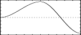

<!--
id:GEN06
category:
-->
# GEN06
Generates function comprised of segments of cubic polynomials, spanning specified points just three at a time.

## Syntax
``` csound-orc
f  #   time   size   6   a   n1   b   n2   c   n3   d ...
```

### Initialization

_size_ -- number of points in the table. Must be a power off or power-of-2 plus 1 (see [f statement](../../scoregens/f)).

_a, c, e, ..._ -- local maxima or minima of successive segments, depending on the relation of these points to adjacent inflexions. May be either positive or negative.

_b, d, f, ..._ -- ordinate values of points of inflexion at the ends of successive curved segments. May be positive or negative.

_n1, n2, n3 ..._ -- number of stored values between specified points. Cannot be negative, but a zero is meaningful for specifying discontinuities. The sum _n1_ + _n2_ + ... will normally equal size for fully specified functions. (for details, see [GEN05](../../scoregens/gen05)).

> :memo: **Note**
>
> _GEN06_ constructs a stored function from segments of cubic polynomial functions. Segments link ordinate values in groups of 3: point of inflexion, maximum/minimum, point of inflexion. The first complete segment encompasses _b_, _c_, _d_ and has length _n2_ + _n3_, the next encompasses _d_, _e_, _f_ and has length _n4_ + _n5_, etc. The first segment (_a_, _b_ with length _n1_) is partial with only one inflexion; the last segment may be partial too. Although the inflexion points _b_, _d_, _f_ ... each figure in two segments (to the left and right), the slope of the two segments remains independent at that common point (i.e. the 1st derivative will likely be discontinuous). When _a_, _c_, _e_... are alternately maximum and minimum, the inflexion joins will be relatively smooth; for successive maxima or successive minima the inflexions will be comb-like.
>

## Examples

Here is an example of the GEN06 routine. It uses the files [gen06.csd](../../examples/gen06.csd).

``` csound-csd title="An example of the GEN06 routine." linenums="1"
--8<-- "examples/gen06.csd"
```

These are the diagrams of the waveforms of the GEN06 routines, as used in the example:

<figure markdown="span">

<figcaption>f 2 0 513 6 1 128 -1 128 1 64 -.5 64 .5 16 -.5 8 1 16 -.5 8 1 16 -.5 84 1 16 -.5 8 .1 16 -.1 17 0 - a not-so-smooth curve</figcaption>
</figure>

<figure markdown="span">

<figcaption>f 3 0 513 6 0 128 0.5 128 1 128 0 129 -1 - a curve running 0 to 1 to -1, with a minimum, maximum and minimum at these values respectively. Inflexions are at .5 and 0 and are relatively smooth</figcaption>
</figure>

## See Also

[GEN05](../../scoregens/gen05), [GEN07](../../scoregens/gen07), and [GEN08](../../scoregens/gen08)
