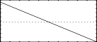

<!--
id:GEN07
category:
-->
# GEN07
Constructs functions from segments of straight lines.

## Syntax
``` csound-orc
f  #    time    size   7   a   n1   b   n2   c  ...
```

### Initialization

_size_ -- number of points in the table. Must be a power of 2 or power-of-2 plus 1 (see [f statement](../../scoregens/f)).

_a, b, c,_ etc. -- ordinate values, in odd-numbered pfields p5, p7, p9, . . .

_n1, n2_, etc. -- length of segment (no. of storage locations), in even-numbered pfields. Cannot be negative, but a zero is meaningful for specifying discontinuous waveforms (e.g. in the example below). The sum _n1_ + _n2_ + .... will normally equal _size_ for fully specified functions. If the sum is smaller, the function locations not included will be set to zero; if the sum is greater, only the first _size_ locations will be stored.

> :memo: **Note**
>
> * If p4 is positive, functions are post-normalized (rescaled to a maximum absolute value of 1 after generation). A negative p4 will cause rescaling to be skipped.
> * Discrete-point linear interpolation implies an increase or decrease along a segment by equal differences between adjacent locations; exponential interpolation implies that the progression is by equal ratio. In both forms the interpolation from _a_ to _b_ is such as to assume that the value _b_ will be attained in the n + 1th location. For discontinuous functions, and for the segment encompassing the end location, this value will not actually be reached, although it may eventually appear as a result of final scaling.

## Examples

Here is an example of the GEN07 routine. It uses the files [gen07.csd](../../examples/gen07.csd).

``` csound-csd title="An example of the GEN07 routine." linenums="1"
--8<-- "examples/gen07.csd"
```

These are the diagrams of the waveforms of the GEN07 routines, as used in the example:

<figure markdown="span">

<figcaption>f 2 0 1024 7 0 512 1 0 -1 512 0 - sawtooth up and down, starting and ending at 0</figcaption>
</figure>

<figure markdown="span">

<figcaption>f 3 0 1024 7 1 512 1 0 -1 512 -1 - a square from positive to negative</figcaption>
</figure>

<figure markdown="span">

<figcaption>f 4 0 1024 7 1 1024 -1 - sawtooth down, a straight line from positive to negative</figcaption>
</figure>

## See Also

[GEN05](../../scoregens/gen05), [GEN06](../../scoregens/gen06), and [GEN08](../../scoregens/gen08)
