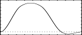
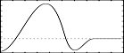

<!--
id:GEN08
category:
-->
# GEN08
Generate a piecewise cubic spline curve, the smoothest possible through all specified points.

## Syntax
``` csound-orc
f # time size 8 a n1 b n2 c n3 d ...
```

### Initialization

_size_ -- number of points in the table. Must be a power of 2 or power-of-2 plus 1 (see [f statement](../../scoregens/f)).

_a, b, c,_ etc. -- ordinate values of the function.

_n1, n2, n3 ... _ -- length of each segment measured in stored values. May not be zero, but may be fractional. A particular segment may or may not actually store any values; stored values will be generated at integral points from the beginning of the function. The sum _n1_ + _n2_ + ... will normally equal _size_ for fully specified functions.

> :memo: **Note**
>
> * _GEN08_ constructs a stored table from segments of cubic polynomial functions. Each segment runs between two specified points but depends as well on their neighbors on each side. Neighboring segments will agree in both value and slope at their common point. (The common slope is that of a parabola through that point and its two neighbors). The slope at the two ends of the function is constrained to be zero (flat).
> * _Hint:_ to make a discontinuity in slope or value in the function as stored, arrange a series of points in the interval between two stored values; likewise for a non-zero boundary slope.

## Examples

Here is an example of the GEN08 routine. It uses the files [gen08.csd](../../examples/gen08.csd).

``` csound-csd title="An example of the GEN08 routine." linenums="1"
--8<-- "examples/gen08.csd"
```

These are the diagrams of the waveforms of the GEN08 routines, as used in the example:

<figure markdown="span">

<figcaption>f 2 0 65 8 0 16 1 16 1 16 0 17 0 - a curve with a smooth hump in the middle, going briefly negative outside the hump then flat at its ends</figcaption>
</figure>

<figure markdown="span">

<figcaption>f 3 0 65 8 -1 32 1 2 0 14 0 17 0 - from a negative value,a curve with a smooth hump, going negative creating a small hump then flat at its ends</figcaption>
</figure>

## See Also

[GEN05](../../scoregens/gen05), [GEN06](../../scoregens/gen06), and [GEN07](../../scoregens/gen07)
