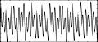

<!--
id:GEN09
category:
-->
# GEN09
Generate composite waveforms made up of weighted sums of simple sinusoids.

The specification of each contributing partial requires 3 p-fields using _GEN09_.

## Syntax
``` csound-orc
f # time size 9 pna stra phsa pnb strb phsb ...
```

### Initialization

_size_ -- number of points in the table. Must be a power of 2 or power-of-2 plus 1 (see [f statement](../../scoregens/f)).

_pna, pnb_, etc. -- partial no. (relative to a fundamental that would occupy _size_ locations per cycle) of sinusoid a, sinusoid b, etc. Must be positive, but need not be a whole number, i.e., non-harmonic partials are permitted. Partials may be in any order.

_stra, strb_, etc. -- strength of partials _pna, pnb_, etc. These are relative strengths, since the composite waveform may be rescaled later. Negative values are permitted and imply a 180 degree phase shift.

_phsa, phsb_, etc. -- initial phase of partials _pna, pnb,_ etc., expressed in degrees (0-360).

> :memo: **Note**
>
> * These subroutines generate stored functions as sums of sinusoids of different frequencies. The two major restrictions on _GEN10_ that the partials be harmonic and in phase do not apply to _GEN09_ or _GEN19_. 
> * In each case the composite wave, once drawn, is then rescaled to unity if p4 was positive. A negative p4 will cause rescaling to be skipped.

## Examples

Here is an example of the GEN09 routine. It uses the files [gen09.csd](../../examples/gen09.csd).

``` csound-csd title="Example of the GEN09 routine." linenums="1"
--8<-- "examples/gen09.csd"
```

These are the diagrams of the waveforms of the GEN09 routines, as used in the example:

<figure markdown="span">

<figcaption>gi1 ftgen 1,0,2^10,9,  1,3,0,   3,1,0, 9,0.333,180 - approximation of a square wave</figcaption>
</figure>

<figure markdown="span">

<figcaption>gi2 ftgen 2,0,2^10,9,  1,3,180,   3,1,0, 9,0.333,0 - same values as gi1, except phase value</figcaption>
</figure>

<figure markdown="span">

<figcaption>gi3 ftgen 3,0,2^10,9,  1,2,0,   3,2,0, 9,0.333,180 - inharmonic partials, but with distortion due to the sudden jump in ending and beginning of the wave</figcaption>
</figure>

<figure markdown="span">

<figcaption>gi4 ftgen 4,0,2^10,9,  1,2,180,   3,2,0, 9,0.333,0 - same ratio as gi3, except with less artefacts</figcaption>
</figure>

## See Also

[GEN10](../../scoregens/gen10),
[GEN19](../../scoregens/gen19)
