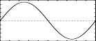
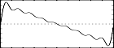

<!--
id:GEN10
category:
-->
# GEN10
Generate composite waveforms made up of weighted sums of simple sinusoids.

The specification of each contributing partial requires 1 pfield using _GEN10_.

## Syntax
``` csound-orc
f # time size 10 str1 str2 str3 str4 ...
```

### Initialization

_size_ -- number of points in the table. Must be a power of 2 or power-of-2 plus 1 (see [f statement](../../scoregens/f)).

_str1, str2, str3, etc._ -- relative strengths of the fixed harmonic partial numbers 1, 2, 3, etc., beginning in p5. Partials not required should be given a strength of zero.

> :memo: **Note**
>
> * These subroutines generate stored functions as sums of sinusoids of different frequencies. The two major restrictions on _GEN10_ that the partials be harmonic and in phase do not apply to _GEN09_ or _GEN19_.
> * In each case the composite wave, once drawn, is then rescaled to unity if p4 was positive. A negative p4 will cause rescaling to be skipped.

## Examples

Here is an example of the GEN10 routine. It uses the files [gen10.csd](../../examples/gen10.csd).

``` csound-csd title="An example of the GEN10 routine." linenums="1"
--8<-- "examples/gen10.csd"
```

These are the diagrams of the waveforms of the GEN10 routines, as used in the example:

<figure markdown="span">

<figcaption>f 1 0 16384 10 1 - sine wave with only the fundamental frequency</figcaption>
</figure>

<figure markdown="span">

<figcaption>f 2 0 16384 10 1 0.5 0.3 0.25 0.2 0.167 0.14 0.125 .111 - sawtooth, with a fundamental and 8 harmonics </figcaption>
</figure>

<figure markdown="span">

<figcaption>f 3 0 16384 10 1 0 0.3 0 0.2 0 0.14 0 .111 - square wave, with a fundamental and 8 harmonics but 4 have 0 strength</figcaption>
</figure>

<figure markdown="span">

<figcaption>f 4 0 16384 10 1 1 1 1 0.7 0.5 0.3 0.1 - pulse wave, with a fundamental and 8 harmonics</figcaption>
</figure>

## See Also

[GEN09](../../scoregens/gen09), [GEN11](../../scoregens/gen11), and [GEN19](../../scoregens/gen19).
