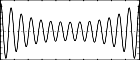

<!--
id:GEN11
category:
-->
# GEN11
Generates an additive set of cosine partials in the manner of Csound generators [buzz](../../opcodes/buzz) and [gbuzz](../../opcodes/gbuzz).

## Syntax
``` csound-orc
f # time size 11 nh [lh] [r]
```

### Initialization

_size_ -- number of points in the table. Must be a power of 2 or power-of-2 plus 1 (see [f statement](../../scoregens/f)).

_nh_ -- number of harmonics requested. Must be positive.

_lh_(optional) -- lowest harmonic partial present. Can be positive, zero or negative. The set of partials can begin at any partial number and proceeds upwards; if _lh_ is negative, all partials below zero will reflect in zero to produce positive partials without phase change (since cosine is an even function), and will add constructively to any positive partials in the set. The default value is 1

_r_(optional) -- multiplier in an amplitude coefficient series. This is a power series: if the _lh_th partial has a strength coefficient of A the (_lh_ + n)th partial will have a coefficient of A * r<sup>n</sup>, i.e. strength values trace an exponential curve. _r_ may be positive, zero or negative, and is not restricted to integers. The default value is 1.

> :memo: **Note**
>
> * This subroutine is a non-time-varying version of the CSound [buzz](../../opcodes/buzz)and [gbuzz](../../opcodes/gbuzz) generators, and is similarly useful as a complex sound source in subtractive synthesis. With _lh_ and _r_ present it parallels _gbuzz_; with both absent or equal to 1 it reduces to the simpler _buzz_ (i.e. _nh_ equal-strength harmonic partials beginning with the fundamental).
> * Sampling the stored waveform with an oscillator is more efficient than using the dynamic buzz units. However, the spectral content is invariant and care is necessary, lest the higher partials exceed the Nyquist during sampling to produce fold-over.

## Examples

Here is an example of the GEN11 routine. It uses the files [gen11.csd](../../examples/gen01.csd).

``` csound-csd title="An example of the GEN11 routine." linenums="1"
--8<-- "examples/gen11.csd"
```

These are the diagrams of the waveforms of the GEN11 routines, as used in the example:

<figure markdown="span">

<figcaption>f 1 0 16384 11 1 1</figcaption>
</figure>

<figure markdown="span">

<figcaption>f 2 0 16384 11 10 1 .7</figcaption>
</figure>

<figure markdown="span">

<figcaption>f 3 0 16384 11 10 5 2</figcaption>
</figure>

## See Also

[GEN10](../../scoregens/gen10)
