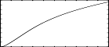

<!--
id:GEN12
category:
-->
# GEN12
Generates the log of a modified Bessel function of the second kind, order 0, suitable for use in amplitude-modulated FM.

## Syntax
``` csound-orc
f # time size 12 xint
```

### Initialization

_size_ -- number of points in the table. Must be a power of 2 or a power-of-2 plus 1 (see [f statement](../../scoregens/f)). The normal value is power-of-2 plus 1.

_xint_ -- specifies the _x_ interval [0 to _+xint_] over which the function is defined.

> :memo: **Note**
>
> * This subroutine draws the natural log of a modified Bessel function of the second kind, order 0 (commonly written as _I_ subscript 0), over the x-interval requested. The call should have rescaling inhibited.
> * The function is useful as an amplitude scaling factor in cycle-synchronous amplitude-modulated FM. (See Palamin &amp; Palamin, _J. Audio Eng. Soc., 36/9_, Sept. 1988, pp.671-684.) The algorithm is interesting because it permits the normally symmetric FM spectrum to be made asymmetric around a frequency other than the carrier, and is thereby useful for formant positioning. By using a table lookup index of _I_(r - 1/r), where _I_ is the FM modulation index and _r_ is an exponential parameter affecting partial strengths, the Palamin algorithm becomes relatively efficient, requiring only oscil's, table lookups, and a single _exp_ call.

## Examples

Here is an example of the GEN12 generator. It uses the file [gen12.csd](../../examples/gen12.csd).

``` csound-csd title="Example of the GEN12 generator." linenums="1"
--8<-- "examples/gen12.csd"
```

This is the diagram of the waveform of the GEN12 routines, as used in the example:

<figure markdown="span">

<figcaption>f 37 0 1024 -12 40 - Bessel function-defined from 0 to 40</figcaption>
</figure>

## Credits

Example is, with minor modifications, taken from The Csound Book (page 87).
