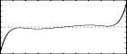

<!--
id:GEN14
category:
-->
# GEN14
Stores a polynomial whose coefficients derive from Chebyshevs of the second kind.

Uses Chebyshev coefficients to generate stored polynomial functions which, under waveshaping, can be used to split a sinusoid into harmonic partials having a pre-definable spectrum.

## Syntax
``` csound-orc
f # time size 14 xint xamp h0 h1 h2 ...
```

### Initialization

_size_ -- number of points in the table. Must be a power of 2 or a power-of-2 plus 1 (see [f statement](../../scoregens/f)). The normal value is power-of-2 plus 1.

_xint_ -- provides the left and right values [_-xint, +xint_] of the x interval over which the polynomial is to be drawn. These subroutines both call [GEN03](../../scoregens/gen03) to draw their functions; the p5 value here is therefore expanded to a negative-positive p5, p6 pair before _GEN03_ is actually called. The normal value is 1.

_xamp_ -- amplitude scaling factor of the sinusoid input that is expected to produce the following spectrum.

_h0, h1, h2,_ etc. -- relative strength of partials 0 (DC), 1 (fundamental), 2 ... that will result when a sinusoid of amplitude

```
xamp * int(size/2)/xint
```

is waveshaped using this function table. These values thus describe a frequency spectrum associated with a particular factor _xamp_ of the input signal.

> :memo: **Note**
>
> * [GEN13](../../scoregens/gen13) is the function generator normally employed in standard waveshaping. It stores a polynomial whose coefficients derive from the Chebyshev polynomials of the first kind, so that a driving sinusoid of strength _xamp_ will exhibit the specified spectrum at output. Note that the evolution of this spectrum is generally not linear with varying _xamp_. However, it is bandlimited (the only partials to appear will be those specified at generation time); and the partials will tend to occur and to develop in ascending order (the lower partials dominating at low _xamp_, and the spectral richness increasing for higher values of _xamp_). A negative _hn_ value implies a 180 degree phase shift of that partial; the requested full-amplitude spectrum will not be affected by this shift, although the evolution of several of its component partials may be. The pattern +,+,-,-,+,+,... for _h0,h1,h2.._. will minimize the normalization problem for low _xamp_ values (see above), but does not necessarily provide the smoothest pattern of evolution.
> * _GEN14_ stores a polynomial whose coefficients derive from Chebyshevs of the second kind.

## Examples

Here is an example of the GEN14 generator. It uses the file [gen14.csd](../../examples/gen14.csd).

``` csound-csd title="Example of the GEN14 generator." linenums="1"
--8<-- "examples/gen14.csd"
```

These are the diagrams of the waveforms of the GEN14 routines, as used in the example:

<figure markdown="span">

<figcaption>f28 0 4097 13  1 1 1 0 .8 0 .5 0 .2 - waveshaping function: GEN13, odd harmonics</figcaption>
</figure>

<figure markdown="span">

<figcaption>f29 0 4097 14  1 1 1 0 .8 0 .5 0 .2 - waveshaping function: GEN14, the same odd harmonics</figcaption>
</figure>

<figure markdown="span">

<figcaption>f30 0 4097 13  1 1 0 1 0 .6 0 .4 0 .1 - waveshaping function: GEN13, even harmonics</figcaption>
</figure>

<figure markdown="span">

<figcaption>f31 0 4097 14  1 1 0 1 0 .6 0 .4 0 .1 - waveshaping function: GEN14, the same even harmonics</figcaption>
</figure>

## See Also

[GEN03](../../scoregens/gen03), [GEN13](../../scoregens/gen13), and [GEN15](../../scoregens/gen15).

Information about the Chebyshev polynomials on Wikipedia: [http://en.wikipedia.org/wiki/Chebyshev_polynomials](http://en.wikipedia.org/wiki/Chebyshev_polynomials)
