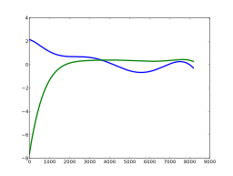

<!--
id:GEN15
category:
-->
# GEN15
Creates two tables of stored polynomial functions, suitable for use in phase quadrature operations.

## Syntax
``` csound-orc
f # time size 15 xint xamp h0 phs0 h1 phs1 h2 phs2 ...
```

### Initialization

_size_ -- number of points in the table. Must be a power of 2 or a power-of-2 plus 1 (see [f statement](../../scoregens/f)). The normal value is power-of-2 plus 1.

_xint_ -- provides the left and right values [_-xint_, _+xint_] of the _x_ interval over which the polynomial is to be drawn. This subroutine will eventually call [GEN03](../../scoregens/gen03) to draw both functions; this p5 value is therefor expanded to a negative-positive p5, p6 pair before _GEN03_ is actually called. The normal value is 1.

_xamp_ -- amplitude scaling factor of the sinusoid input that is expected to produce the following spectrum.

_h0, h1, h2, ... hn_ -- relative strength of partials 0 (DC), 1 (fundamental), 2 ... that will result when a sinusoid of amplitude

```
xamp * int(size/2)/xint
```

is waveshaped using this function table. These values thus describe a frequency spectrum associated with a particular factor _xamp_ of the input signal.

_phs0, phs1, ..._ -- phase in degrees of desired harmonics _h0, h1, ..._ when the two functions of _GEN15_ are used with phase quadrature.

> :memo: **Notes**
>
> _GEN15_ creates two tables of equal size, labeled _f_# and _f_ # + 1. Table # will contain a Chebyshev function of the first kind, drawn using [GEN13](../../scoregens/gen13) with partial strengths _h0cos(phs0), h1cos(phs1), ..._ Table #+1 will contain a Chebyshev function of the 2nd kind by calling [GEN14](../../scoregens/gen14) with partials _h1sin(phs1), h2sin(phs2),..._ (note the harmonic displacement). The two tables can be used in conjunction in a waveshaping network that exploits phase quadrature.
>
> Before version 5.16 there was a bug (pointed out by Menno Knevel and fixed by François Pinot) on the number of pfields transmitted to gen13 and gen14 by gen15. The consequence is that all the csd, or orc and sco files that used gen15 before this bug was fixed, are likely to sound different now.

## Examples

Here is an example of the GEN15 routine. It uses the files [gen15.csd](../../examples/gen15.csd).

``` csound-csd title="An example of the GEN15 routine." linenums="1"
--8<-- "examples/gen15.csd"
```

These are the diagrams of the waveforms of the GEN15 routine, as used in the example
(in each diagram, the curve in blue is for ftable 33 and the curve in green is for
table 34):

<figure markdown="span">

<figcaption>f 33 0 8193 -15 1 1 1 0 1 180 .8 45 .6 270 .5 90 .4 225 .2 135 .1 315</figcaption>
</figure>

<figure markdown="span">

<figcaption>f 33 0 8193 -15 1 1 1 0 1 0 1 180 1 180 1 0 1 0 1 180 1 180 1 0 1 0 1 180 1 180</figcaption>
</figure>

<figure markdown="span">

<figcaption>f 33 0 8193 -15 1 1 1 0 1 0 .9 180 .5 270 .75 90 .4 45 .2 225 .1 0</figcaption>
</figure>

<figure markdown="span">

<figcaption>f 33 0 8193 -15 1  1  1 0 1 0 .5 0 .9 0 .3 0 .75 0 .2 180 .6 180 .15 180 .5 180 .1 180</figcaption>
</figure>

<figure markdown="span">

<figcaption>f 33 0 8193 -15 1 1 1 180 1 180 .5 180 .9 180 .3 180 .75 180 .2 0 .6 0 .15 0 .5 0 .1 0</figcaption>
</figure>

## See Also

[GEN13](../../scoregens/gen13), and [GEN14](../../scoregens/gen14).
