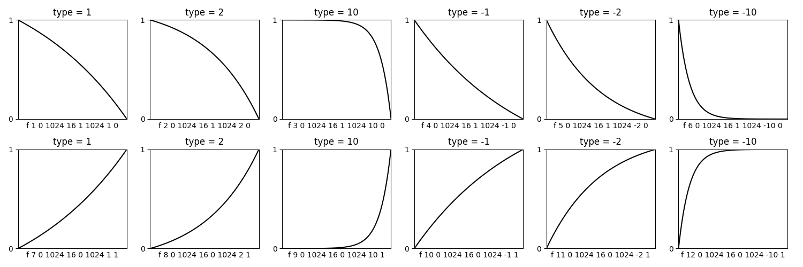

<!--
id:GEN16
category:
-->
# GEN16
Creates a table from a starting value to an ending value.

## Syntax
``` csound-orc
f # time size 16 val1 dur1 type1 val2 [dur2 type2 val3 ... typeX valN]
```

### Initialization

_size_ -- number of points in the table. Must be a power of 2 or a power-of-2 plus 1 (see [f statement](../../scoregens/f)). The normal value is power-of-2 plus 1.

> :memo: **Note**
>
> The end value is only reached  when the table length is power-of-2 plus 1. (This length is crucial for use with the tab generator.)

_beg_ -- starting value

_dur_ -- number of segments

_type_ -- if 0, a straight line is produced. If non-zero, then _GEN16_ creates the following curve, for _dur_ steps:

```
beg + (end - beg) * (1 - exp( i*type/(dur-1) )) / (1 - exp(type))
```

_end_ -- value after _dur_ segments

Here are some examples of the curves generated for different values of _type_:

<figure markdown="span">

<figcaption>Tables generated by GEN16 for different values of type.</figcaption>
</figure>

> :memo: **Note**
>
> If _type_ &gt; 0, there is a slowly rising (concave) or slowly decaying (convex) curve, while if _itype_ &lt; 0, the curve is fast rising (convex) or fast decaying (concave). See also [transeg](../../opcodes/transeg).


``` csound-csd title="A simple example of the GEN16 routine." linenums="1"
--8<-- "examples/gen16.csd"
```

## Credits

Author: John ffitch<br>
University of Bath, Codemist. Ltd.<br>
Bath, UK<br>
October, 2000<br>

New in Csound version 4.09
