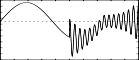

<!--
id:GEN18
category:
-->
# GEN18
Writes composite waveforms made up of pre-existing waveforms.

Each contributing waveform requires 4 pfields and can overlap with other waveforms.

## Syntax
``` csound-orc
f # time size 18 fna ampa starta finisha fnb ampb startb finishb ...
```

### Initialization

_size_ -- number of points in the table. Must be a power-of-2 (see [f](../../scoregens/f) statement).

_fna, fnb, etc._ -- pre-existing table number to be written into the table.

_ampa, ampb, etc._ -- strength of wavefoms. These are relative strengths, since the composite waveform may be rescaled later. Negative values are permitted and imply a 180 degree phase shift.

_starta, startb, etc._ -- where to start writing the fn into the table.

_finisha, finishb, etc._ -- where to stop writing the fn into the table. The last available location is the power of two - 1.

## Examples

``` csound-sco
f 1  0  4096  10  1
f 2  0  1024  18  1  1  0  511  1  1  512  1023
```

f2 consists of two copies of f1 written in to locations 0-511 and 512-1023.

Here is an example of the GEN18 routine. It uses the files [gen18.csd](../../examples/gen18.csd).

``` csound-csd title="An example of the GEN18 routine." linenums="1"
--8<-- "examples/gen18.csd"
```

These are the diagrams of the waveforms generated by GEN18, as used in the example:

<figure markdown="span">

<figcaption>f 11 0 8193 18 1 1 0 4096 2 1 4097 8192 - composite waveform made up of a sine wave and a sawtooth</figcaption>
</figure>

<figure markdown="span">

<figcaption>f 12 0 8192  18 1 1 0 4096 3 1 4097 8192 - composite waveform made up of a sine wave and a wave of cosine partials</figcaption>
</figure>

<figure markdown="span">

<figcaption>f 13 0 1024  18 1 0.7 0 767 3 0.7 512 1023 - sine+cosine partials overlapped, also shorter table than f12</figcaption>
</figure>

## Deprecated Names

_GEN18_ was called _GEN22_ in version 4.18. The name was changed due to a conflict with DirectCsound.

## Credits

Author: William &#8220;Pete&#8221; Moss<br>
University of Texas at Austin<br>
Austin, Texas USA<br>
January 2002<br>

New in version 4.18, changed in version 4.19
