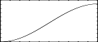

<!--
id:GEN19
category:
-->
# GEN19
Generate composite waveforms made up of weighted sums of simple sinusoids.

The specification of each contributing partial requires 4 p-fields using _GEN19_.

## Syntax
``` csound-orc
f # time size  19  pna   stra  phsa  dcoa  pnb strb  phsb  dcob  ...
```

### Initialization

_size_ -- number of points in the table. Must be a power of 2 or power-of-2 plus 1 (see [f statement](../../scoregens/f)).

_pna, pnb_, etc. -- partial no. (relative to a fundamental that would occupy _size_ locations per cycle) of sinusoid a, sinusoid b, etc. Must be positive, but need not be a whole number, i.e., non-harmonic partials are permitted. Partials may be in any order.

_stra, strb_, etc. -- strength of partials _pna, pnb_, etc. These are relative strengths, since the composite waveform may be rescaled later. Negative values are permitted and imply a 180 degree phase shift.

_phsa, phsb_, etc. -- initial phase of partials _pna, pnb,_ etc., expressed in degrees.

_dcoa, dcob_, etc. -- DC offset of partials _pna, pnb_, etc. This is applied _after_ strength scaling, i.e. a value of 2 will lift a 2-strength sinusoid from range [-2,2] to range [0,4] (before later rescaling).

> :memo: **Note**
>
> * These subroutines generate stored functions as sums of sinusoids of different frequencies. The two major restrictions on _GEN10_ that the partials be harmonic and in phase do not apply to _GEN09_ or _GEN19_.
> * In each case the composite wave, once drawn, is then rescaled to unity if p4 was positive. A negative p4 will cause rescaling to be skipped.

## Examples

Here is an example of the GEN19 routine. It uses the files [gen19.csd](../../examples/gen19.csd).

``` csound-csd title="An example of the GEN19 routine." linenums="1"
--8<-- "examples/gen19.csd"
```

This is the diagram of the waveform of the GEN19 routines, as used in the example:

<figure markdown="span">

<figcaption>f 2 0 1024 19 .5 .5 270 .5 - a rising sigmoid</figcaption>
</figure>

## See Also

[GEN09](../../scoregens/gen09) and [GEN10](../../scoregens/gen10)
