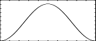

<!--
id:GEN20
category:
-->
# GEN20
Generates functions of different windows.

These windows are usually used for spectrum analysis or for grain envelopes.

## Syntax
``` csound-orc
f # time size 20 window max [opt]
```

### Initialization

_size_ -- number of points in the table. Must be a power of 2 ( + 1).

_window_ -- Type of window to generate:

*  1 = Hamming
*  2 = Hanning
*  3 = Bartlett ( triangle)
*  4 = Blackman ( 3-term)
*  5 = Blackman - Harris ( 4-term)
*  6 = Gaussian
*  7 = Kaiser
*  8 = Rectangle
*  9 = Sinc

_max_ -- For negative p4 this will be the absolute value at window peak point. If p4 is positive or p4 is negative and p6 is missing the table will be post-rescaled to a maximum value of 1.

_opt_ -- Optional argument required by the Gaussian window, the Kaiser window and the Sinc window.

## Examples

``` csound-sco
f   1   0   1024   20    5
```

This creates a function which contains a 4 - term Blackman - Harris window with maximum value of 1.

``` csound-sco
f   1   0   1024   -20   2   456
```

This creates a function that contains a Hanning window with a maximum value of 456.

``` csound-sco
f   1   0   1024   -20   1
```

This creates a function that contains a Hamming window with a maximum value of 1.

``` csound-sco
f   1   0   1024   20    7   1   2
```

This creates a function that contains a Kaiser window with a maximum value of 1. The extra argument specifies how &quot;open&quot; the window is, for example a value of 0 results in a rectangular window and a value of 10 in a Hamming like window.

``` csound-sco
f   1   0   1024   20    6   1   2
```

This creates a function that contains a Gaussian window with a maximum value of 1.  The extra argument specifies how broad the window is, as the standard deviation of the curve; in this example the s.d. is 2.  The default value is 1.

``` csound-sco
f   1   0   1024   20    9   1   3
```

This creates a function that contains a Sinc window with a maximum value of 1.  The extra argument specifies the range of the function as multiple of &#960;.  The default value is 1.

For all diagrams, see [Window Functions](../../misc/windows)

Here is an example of the GEN20 routine. It uses the file [gen20.csd](../../examples/gen20.csd).

``` csound-csd title="Example of the GEN20 routine." linenums="1"
--8<-- "examples/gen20.csd"
```

These are the diagrams of the waveforms of the GEN20 routines, as used in the example:

<figure markdown="span">

<figcaption>  f 1  0 512 20 2 - Hanning window</figcaption>
</figure>

<figure markdown="span">

<figcaption>  f 2  0 512 20 6 1 - Gaussian window</figcaption>
</figure>

## Credits

Author: Paris Smaragdis<br>
MIT, Cambridge<br>
1995<br>

Author: John ffitch<br>
University of Bath/Codemist Ltd.<br>
Bath, UK<br>

New in Csound version 3.2

Optional argument to Gaussian added in 5.10
