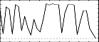
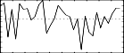
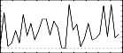

<!--
id:GEN21
category:
-->
# GEN21
Generates tables of different random distributions.

(See also [betarand](../../opcodes/betarand), [bexprnd](../../opcodes/bexprnd), [cauchy](../../opcodes/cauchy), [exprand](../../opcodes/exprand), [gauss](../../opcodes/gauss), [linrand](../../opcodes/linrand), [pcauchy](../../opcodes/pcauchy), [poisson](../../opcodes/poisson), [trirand](../../opcodes/trirand), [unirand](../../opcodes/unirand), and [weibull](../../opcodes/weibull))

## Syntax
``` csound-orc
f # time size 21 type level [arg1  [arg2]]
```

### Initialization

_time_ and _size_ are the usual GEN function arguments. _level_ defines the amplitude. Note that GEN21 is not self-normalizing as are most other GEN functions. _type_ defines the distribution to be used as follow:

*  1 = Uniform (positive numbers only)
*  2 = Linear (positive numbers only)
*  3 = Triangular (positive and negative numbers)
*  4 = Exponential (positive numbers only)
*  5 = Biexponential (positive and negative numbers)
*  6 = Gaussian (positive and negative numbers)
*  7 = Cauchy (positive and negative numbers)
*  8 = Positive Cauchy (positive numbers only)
*  9 = Beta (positive numbers only)
*  10 = Weibull (positive numbers only)
*  11 = Poisson (positive numbers only)

Of all these cases only 9 (Beta) and 10 (Weibull) need extra arguments. Beta needs two arguments and Weibull one.

If _type_ = 6, the random numbers in the ftable follow a normal distribution centered around 0.0 (mu = 0.0) with a variance (sigma) of _level_ / 3.83. Thus more than 99.99% of the random values generated are in the range -_level_ to +_level_. The default value for _level_ is 1 (sigma = 0.261). If a mean value different of 0.0 is desired, this mean value has to be added to the generated numbers.

## Examples

``` csound-sco
f1 0 1024 21 1       ; Uniform (white noise)
f1 0 1024 21 6       ; Gaussian (mu=0.0, sigma=1/3.83=0.261)
f1 0 1024 21 6 5.745 ; Gaussian (mu=0.0, sigma=5.745/3.83=1.5)
f1 0 1024 21 9 1 1 2 ; Beta (note that level precedes arguments)
f1 0 1024 21 10 1 2  ; Weibull
```

All of the above additions were designed by the author between May and December 1994, under the supervision of Dr. Richard Boulanger.

Here is a complete example of the GEN21 routine. It uses the file [gen21.csd](../../examples/gen21.csd).

``` csound-csd title="Example of the GEN21 routine." linenums="1"
--8<-- "examples/gen21.csd"
```

These are the diagrams of the waveforms of the GEN21 routines, as used in the example:

<figure markdown="span">

<figcaption>f 1 0 32 21 1 - positive numbers only</figcaption>
</figure>

<figure markdown="span">

<figcaption>f 2 0 32 21 6</figcaption>
</figure>

<figure markdown="span">

<figcaption>f 3 0 32 21 6 5.745</figcaption>
</figure>

<figure markdown="span">

<figcaption>f 4 0 32 21 9 1 1 2 - positive numbers only</figcaption>
</figure>

<figure markdown="span">

<figcaption>f 5 0 32 21 10 1 2 - positive numbers only</figcaption>
</figure>

## Credits

Author: Paris Smaragdis<br>
MIT, Cambridge<br>
1995<br>

Author: John ffitch<br>
University of Bath/Codemist Ltd.<br>
Bath, UK<br>

Precisions about mu and sigma added by François Pinot after a discussion with Joachim Heintz on the Csound List, December 2010.

New in Csound version 3.2
