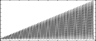

<!--
id:GEN23
category:
-->
# GEN23
Reads numeric values from an external ASCII file.

## Syntax
``` csound-orc
f # time size -23 &quot;filename.txt&quot;
```

### Initialization

_&quot;filename.txt&quot;_ -- numeric values contained in &quot;filename.txt&quot; (which indicates the complete pathname of the character file to be read), can be separated by spaces, tabs, newline characters or commas.

_size_ -- number of points in the table. Must be a power of 2 , power of 2 + 1, or zero.  If _size_ = 0, table size is determined by the number of numeric values in _filename.txt_. (New in Csound version 3.57)

> :memo: **Note**
>
> All characters following ';', '#' (comment) or '&lt;' (XML tag from version 6.04) are ignored until next line (numbers too).


## Examples

Here is an example of the GEN23 generator. It uses the file [gen23.csd](../../examples/gen23.csd) and [spectrum.txt](../../examples/spectrum.txt).

``` csound-csd title="Example of the GEN23 generator." linenums="1"
--8<-- "examples/gen23.csd"
```

This is the diagram of the waveform of the GEN23 routine, as used in the example:

<figure markdown="span">

<figcaption>f 2 0 128 -23 "spectrum.txt" - not normalized</figcaption>
</figure>

## Credits

Author: Gabriel Maldonado<br>
Italy<br>
February, 1998<br>

New in Csound version 3.47. Comments starting with '#' are
ignored from Csound version 5.12.
