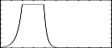

<!--
id:GEN25
category:
-->
# GEN25
Construct functions from segments of exponential curves in breakpoint fashion.

## Syntax
``` csound-orc
f # time size 25 x1 y1 x2 y2 x3  ...
```

### Initialization

_size_ -- number of points in the table. Must be a power of 2 or power-of-2 plus 1 (see [f statement](../../scoregens/f)).

_x1, x2, x3,_ etc. -- locations in table at which to attain the following y value. Must be in increasing order. If the last value is less than size, then the rest will be set to zero. Should not be negative but can be zero.

_y1, y2, y3,_, etc. -- Breakpoint values attained at the location specified by the preceding x value. These must be non-zero and must be alike in sign.

> :memo: **Note**
>
> If p4 is positive, functions are post-normalized (rescaled to a maximum absolute value of 1 after generation). A negative p4 will cause rescaling to be skipped.

## Examples

Here is an example of the GEN25 generator. It uses the file [gen25.csd](../../examples/gen25.csd).

``` csound-csd title="Example of the GEN25 generator." linenums="1"
--8<-- "examples/gen25.csd"
```

This is the diagram of the waveform of the GEN25 routine, as used in the example:

<figure markdown="span">

<figcaption>f 2 0 1025 25 0 0.01 200 1 400 1 513 0.01 - a function which begins at 0.01, rises to 1 at the 200th table location, makes a straight line to the 400th location, and returns to 0.01 by the end of the table</figcaption>
</figure>

## See Also

[f statement](../../scoregens/f), [GEN27](../../scoregens/gen27)

## Credits

Author: John ffitch<br>
University of Bath/Codemist Ltd.<br>
Bath, UK<br>

New in Csound version 3.49
