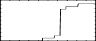

<!--
id:GEN40
category:
-->
# GEN40
Generates a continuous random distribution function starting from the shape of a user-defined distribution histogram.

## Syntax
``` csound-orc
f # time size 40 shapetab
```

### Performance

The shape of histogram must be stored in a previously defined table, in fact shapetab argument must be filled with the number of such table.

Histogram shape can be generated with any other GEN routines. Since no interpolation is used when _GEN40_ processes the translation, it is suggested that the size of the table containing the histogram shape to be reasonably big, in order to obtain more precision (however after the processing the shaping-table can be destroyed in order to re-gain memory). 

This subroutine is designed to be used together with cuserrnd opcode (see [cuserrnd](../../opcodes/cuserrnd) for more information).

## Examples

``` csound-csd title="Example of the GEN40 generator." linenums="1"
--8<-- "examples/gen40.csd"
```

Its output should include lines like these:

```
i   1 time     0.00067:    53.14918
i   1 time     0.20067:     0.00000
i   1 time     0.40067:     0.00000
i   1 time     0.60067:    96.80406
i   1 time     0.80067:    94.20729
i   1 time     1.00000:     0.00000
i   1 time     1.20067:    86.13032
i   1 time     1.40067:    31.37096
i   1 time     1.60067:    70.35889
i   1 time     1.80000:     0.00000
i   1 time     2.00000:    49.18914

WARNING: Seeding from current time 2006647442

i   2 time     3.00067:    21.45002
i   2 time     3.20067:    44.32333
i   2 time     3.40067:    46.05420
i   2 time     3.60000:     0.00000
i   2 time     3.80067:    41.32175
i   2 time     4.00000:     0.00000
i   2 time     4.20000:    63.72019
i   2 time     4.40067:     0.00000
i   2 time     4.60067:     0.00000
i   2 time     4.80067:     0.00000
i   2 time     5.00000:    74.49330
```

This is the diagram of the waveform of the GEN40 routine, as used in the example:

<figure markdown="span">

<figcaption>f 2 0 16384 40 1</figcaption>
</figure>

## Credits

Author: Gabriel Maldonado
