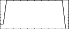

<!--
id:GEN41
category:
-->
# GEN41
Generates a discrete random distribution function by giving a list of numerical pairs.

## Syntax
``` csound-orc
f # time size -41 value1 prob1 value2 prob2 value3 prob3 ... valueN probN
```

### Performance

The first number of each pair is a value, and the second is the probability of that value to be chosen by a random algorithm. Even if any number can be assigned to the probability element of each pair, it is suggested to give it a percent value, in order to make it clearer for the user.

This subroutine is designed to be used together with duserrnd and [urd](../../opcodes/urd) opcodes (see [duserrnd](../../opcodes/duserrnd) for more information).

## Examples

Here is an example of the GEN41 generator. It uses the file [gen41.csd](../../examples/gen41.csd).

``` csound-csd title="Example of the GEN41 generator." linenums="1"
--8<-- "examples/gen41.csd"
```

Its output should include lines like these:

```
i   1 time     0.00067:     8.00000
i   1 time     0.00133:     8.00000
i   1 time     0.00200:     8.00000
i   1 time     0.00267:     8.00000
i   1 time     0.00333:     2.00000
i   1 time     0.00400:     8.00000
i   1 time     0.00533:     8.00000
i   1 time     0.00600:     8.00000
..........
```

This is the diagram of the waveform of the GEN41 routine, as used in the example:

<figure markdown="span">

<figcaption>f 1 0 -20 -41  2 .1 8 .9</figcaption>
</figure>

## Credits

Author: Gabriel Maldonado
