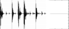

<!--
id:GEN49
category:
-->
# GEN49
Transfers data from an MP3 soundfile into a function table.

## Syntax
``` csound-orc
f#  time  size  49  filcod  skiptime  format
```

### Performance

_size_ -- number of points in the table. Ordinarily a power of 2 or a power-of-2 plus 1 (see [f statement](../../scoregens/f)); the maximum tablesize is 16777216 (2<sup>24</sup>) points. The allocation of table memory can be _deferred_ by setting this parameter to 0; the size allocated is then the number of points in the file (probably not a power-of-2), and the table is not usable by normal oscillators, but it is usable by a [loscil](../../opcodes/loscil) unit. The soundfile can also be mono or stereo.

_filcod_ -- integer or character-string denoting the source soundfile name. An integer denotes the file _soundin_._filcod_ ; a character-string (in double quotes, spaces permitted) gives the filename itself, optionally a full pathname. If not a full path, the file is sought first in the current directory, then in that given by the environment variable [SSDIR](../../command/environment) (if defined) then by [SFDIR](../../command/environment). See also [soundin](../../opcodes/soundin).

_skiptime_ -- begin reading at _skiptime_ seconds into the file.

_format_ -- specifies the audio data-file format required:

```
1 - Mono file                 3 - First channel (left)
2 - Stereo file               4 - Second channel (right)
```

If _format_ = 0 the sample format is taken from the soundfile header.

> :memo: **Note**
>
> * Reading stops at end-of-file or when the table is full. Table locations not filled will contain zeros.
> * If p4 is positive, the table will be post-normalized (rescaled to a maximum absolute value of 1 after generation). A negative p4 will cause rescaling to be skipped.

## Examples

Here is an example of the GEN49 routine. It uses the files [gen49.csd](../../examples/gen49.csd).

``` csound-csd title="An example of the GEN49 routine." linenums="1"
--8<-- "examples/gen49.csd"
```

This is the diagram of the waveforms of the GEN49 routine, as used in the example:

<figure markdown="span">

<figcaption>f 1 0 131072 49 "beats.mp3" 0 1</figcaption>
</figure>

## Credits

Written by John ffitch

February 2009.
