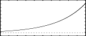

<!--
id:GENexp
category:
-->
# GENexp
Generate a table with values on the exp function.

## Syntax
``` csound-orc
f # time size "exp" start end rescale
```

### Initialization

_size_ -- number of points in the table. Must be a power of 2 or power-of-2 plus 1 (see [f statement](../../scoregens/f)).

_start, end_ -- first and last value to be stored; the GEN draws a curve that goes from start to end: exp(start) .... exp(end). The points stored are uniformly spaced between these to the table size

_rescale_ -- if not zero the table is not rescaled

## Examples

Here is a simple example of the GENexp routine. It uses the file [genexp.csd](../../examples/genexp.csd).

``` csound-csd title="Example of the GENexp routine." linenums="1"
--8<-- "examples/genexp.csd"
```

These are the diagrams of the waveforms of the GENexp routines, as used in the example:

<figure markdown="span">

<figcaption>  f 2 0 8192 "exp" 0 15 0</figcaption>
</figure>

<figure markdown="span">

<figcaption>  f 3 0 8192 "exp" 0 3 0</figcaption>
</figure>

## See Also

[GENsone](../../scoregens/gensone).

More information on this routine: [http://www.csoundjournal.com/issue11/distortionSynthesis.html](http://www.csoundjournal.com/issue11/distortionSynthesis.html), written by Victor Lazzarini

## Credits

Written by Victor Lazzarini
