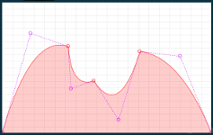
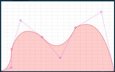
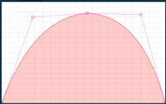

<!--
id:GENquadbezier
category:
-->
# GENquadbezier
Generate a table with values from a quadratic Bézier function.

Plugin gen in quadbezier.

This subroutine creates an ftable from segments constructed by paths traced by the quadratic Bézier function.

## Syntax
``` csound-orc
f # time size "quadbezier" y1 cx1 cy1 x2 y2 [cx2 cy2 x3 y3 ...]
```

### Initialization

_x2, x3,_ etc. -- Locations in table at which to attain the following y value. Must be in increasing order. It is assumed that x1 equals 0. If the last value is less than size, then the rest will be set to zero. Should not be negative.

_y1, y2, y3,_ etc. -- Breakpoint values attained at the location specified by the preceding x value.

_cx1, cx2, cx3,_ etc. -- Virtual x coordinates for the different control points. cx[n] can be equal to but not less than x[n] and equal to but not greater than x[n+1]. Should not be negative but can be zero.

_cy1, cy2, cy3,_ etc. -- Virtual y coordinates for the different control points.

## Examples

Here is a simple example of the GENquadbezier routine. It uses the file [genquadbezier.csd](../../examples/genquadbezier.csd).

``` csound-csd title="Example of the GENquadbezierroutine." linenums="1"
--8<-- "examples/genquadbezier.csd"
```

These are the diagrams of the envelopes drawn by the GENquadbezier routine, as used in the example above:

<figure markdown="span">

<figcaption>  f 2 0 1024 "quadbezier" 0 140 0.61 324 0.53 338 0.27 449 0.32 571 0.08 675 0.5 873 0.47 1024 0</figcaption>
</figure>

<figure markdown="span">

<figcaption>  f 3 0 1024 "quadbezier" 0 92 0.04 94 0.25 177 0.58 373 0.39 537 0.15 675 0.5 910 0.68 1024 0</figcaption>
</figure>

<figure markdown="span">

<figcaption>  f 4 0 1024 "quadbezier" 0 196 0.68 537 0.71 873 0.7 1024 0</figcaption>
</figure>

## See also

For references, check the comments in the [source code](https://github.com/csound/csound/blob/develop/Opcodes/quadbezier.c).

## Credits

Written by Guillermo Senna

2016
