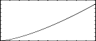

<!--
id:GENsone
category:
-->
# GENsone
GCreates an ftable with values of the sone function for equal power.

## Syntax
``` csound-orc
f # time size "sone" start end equalpoint rescale
```

### Initialization

_size_ -- number of points in the table. Must be a power of 2 or power-of-2 plus 1 (see [f statement](../../scoregens/f)).

_start, end_ -- first and last value to be stored.  The points stored are uniformly spaced between these to the table size.

_equalpoint_ -- the point on the curve when the input and output values are equal.

_rescale_ -- if not zero the table is not rescaled

The table is filled with the function x*POWER(x/eqlp, FL(33.0)/FL(78.0)) for x between the start and end points.  This is the Sone loudness curve.

## Examples

Here is an example of the GENsone routine. It uses the files [gensone.csd](../../examples/gensone.csd).

``` csound-csd title="An example of the GENsone routine." linenums="1"
--8<-- "examples/gensone.csd"
```

This is the diagram of the waveforms of the GENsone routine, as used in the example:

<figure markdown="span">

<figcaption>f 2 0 16385 "sone" 0 32000 32000 0</figcaption>
</figure>

## See Also

More information on Sone: [http://en.wikipedia.org/wiki/Sone](http://en.wikipedia.org/wiki/Sone)

## Credits

Written by John ffitch
