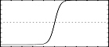
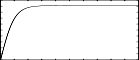

<!--
id:GENtanh
category:
-->
# GENtanh
Generate a table with values on the tanh function.

## Syntax
``` csound-orc
f # time size "tanh" start end rescale
```

### Initialization

_size_ -- number of points in the table. Must be a power of 2 or power-of-2 plus 1 (see [f statement](../../scoregens/f)).

_start, end_ -- first and last value to be stored; the GEN draws a curve that goes from start to end: tanh(start) .... tanh(end). The points stored are uniformly spaced between these to the table size

_rescale_ -- if not zero the table is not rescaled

## Examples

Here is a simple example of the GENtanh routine. It uses the file [gentanh.csd](../../examples/gentanh.csd).

``` csound-csd title="Example of the GENtanh routine." linenums="1"
--8<-- "examples/gentanh.csd"
```

These are the diagrams of the waveforms of the GENtanh routines, as used in the example:

<figure markdown="span">

<figcaption>  f 2 0 8192 "tanh" -100 100 0 - lots of distortion</figcaption>
</figure>

<figure markdown="span">

<figcaption>  f 3 0 8192 "tanh" -10 10 0 - less distortion than f2</figcaption>
</figure>

<figure markdown="span">

<figcaption>  f 4 0 8192 "tanh" -10 15 0</figcaption>
</figure>

## See Also

[GENexp](../../scoregens/genexp) and [GENsone](../../scoregens/gensone).

More information on this routine: [http://www.csoundjournal.com/issue11/distortionSynthesis.html](http://www.csoundjournal.com/issue11/distortionSynthesis.html), written by Victor Lazzarini

## Credits

Written by John ffitch
