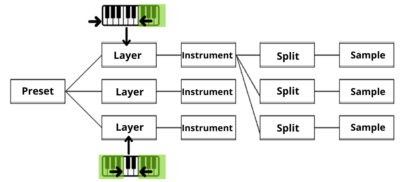

# **Sample Playback**

Opcodes that implement sample playback and looping are:

* [bbcutm](../../opcodes/bbcutm)
* [bbcuts](../../opcodes/bbcuts)
* [flooper](../../opcodes/flooper)
* [flooper2](../../opcodes/flooper2)
* [loscil](../../opcodes/loscil)
* [loscil3](../../opcodes/loscil3)
* [loscilx](../../opcodes/loscilx)
* [lphasor](../../opcodes/lphasor)
* [lposcil](../../opcodes/lposcil)
* [lposcil3](../../opcodes/lposcil3)
* [lposcila](../../opcodes/lposcila)
* [lposcilsa](../../opcodes/lposcilsa)
* [lposcilsa2](../../opcodes/lposcilsa2)
* [sndloop](../../opcodes/sndloop)
* [waveset](../../opcodes/waveset)

See also the [Signal Input](../../sigio/input) section for other ways to input sound.

## **Soundfonts**

Beginning with Csound Version 4.07, Csound supports the SoundFont2 sample file format. SoundFont2 (or SF2) is a widespread standard which allows encoding banks of wavetable-based sounds into a binary file. In order to understand the usage of these opcodes, the user must have some knowledge of the SF2 format, so a brief description of this format follows.

The SF2 format is made by generator and modulator objects. All current Csound opcodes regarding SF2 support the generator function only.

There are several levels of generators having a hierarchical structure. The most basic kind of generator object is a sample. Samples may or may not be be looped, and are associated with a MIDI note number, called the base-key. When a sample is associated with a range of MIDI note numbers, a range of velocities, a transposition (coarse and fine tuning), a scale tuning, and a level scaling factor, the sample and its associations make up a &#8220;split.&#8221; A set of splits, together with a name, make up an &#8220;instrument.&#8221; When an instrument is associated with a key range, a velocity range, a level scaling factor, and a transposition, the instrument and its associations make up a &#8220;layer.&#8221; A set of layers, together with a name, makes up a &#8220;preset.&#8221; Presets are normally the final sound-generating structures ready for the user. They generate sound according to the settings of their lower-level components.

<figure markdown="span">

<figcaption></figcaption>
</figure>

Both sample data and structure data is embedded in the same SF2 binary file. A single SF2 file can contain up to a maximum of 128 banks of 128 preset programs, for a total of 16384 presets in one SF2 file. The maximum number of layers, instruments, splits, and samples is not defined, and probably is only limited by the computer's memory.

Soundfonts can be viewed and edited by programs like Polyphone ([GPL3, https://www.polyphone-soundfonts.com/](https://www.polyphone-soundfonts.com/)) or Swami ([GPL2, http://www.swamiproject.org](http://www.swamiproject.org))

#### Fluid Opcodes

The fluid family of opcodes wraps Peter Hannape's SoundFont 2 player, FluidSynth: [fluidEngine](../../opcodes/fluidEngine) for instantiating a FluidSynth engine, [fluidSetInterpMethod](../../opcodes/fluidSetInterpMethod) for setting interpolation method for a channel in a FluidSynth engine, [fluidLoad](../../opcodes/fluidLoad) for loading SoundFonts, [fluidProgramSelect](../../opcodes/fluidProgramSelect) for assigning presets from a SoundFont to a FluidSynth engine's MIDI channel, [fluidNote](../../opcodes/fluidNote) for playing a note on a FluidSynth engine's MIDI channel, [fluidCCi](../../opcodes/fluidCCi) for sending a controller message at i-time to a FluidSynth engine's MIDI channel, [fluidCCk](../../opcodes/fluidCCk) for sending a controller message at k-rate to a FluidSynth engine's MIDI channel. [fluidControl](../../opcodes/fluidControl) for playing and controlling loaded Soundfonts (using 'raw' MIDI messages), [fluidOut](../../opcodes/fluidOut) for receiving audio from a single FluidSynth engine, and [fluidAllOut](../../opcodes/fluidAllOut) for receiving audio from all FluidSynth engines.

* [fluidAllOut](../../opcodes/fluidAllOut)
* [fluidCCi](../../opcodes/fluidCCi)
* [fluidCCk](../../opcodes/fluidCCk)
* [fluidControl](../../opcodes/fluidControl)
* [fluidEngine](../../opcodes/fluidEngine)
* [fluidLoad](../../opcodes/fluidLoad)
* [fluidNote](../../opcodes/fluidNote)
* [fluidOut](../../opcodes/fluidOut)
* [fluidProgramSelect](../../opcodes/fluidProgramSelect)
* [fluidSetInterpMethod](../../opcodes/fluidSetInterpMethod)

#### "Original" Soundfont opcodes

These opcodes can also use soundfonts to generate sound. sfplay etc. were created for one purpose -- to access the instruments and samples in SoundFonts. The fluid opcodes were created for another purpose -- to use SoundFonts more or less the way they were designed to be used, i.e. using keyboard mappings, layers, internal processing, etc.

* [sfilist](../../opcodes/sfilist)
* [sfinstr](../../opcodes/sfinstr)
* [sfinstr3](../../opcodes/sfinstr3)
* [sfinstr3m](../../opcodes/sfinstr3m)
* [sfinstrm](../../opcodes/sfinstrm)
* [sfload](../../opcodes/sfload)
* [sfpassign](../../opcodes/sfpassign)
* [sfplay](../../opcodes/sfplay)
* [sfplay3](../../opcodes/sfplay3)
* [sfplay3m](../../opcodes/sfplay3m)
* [sfplaym](../../opcodes/sfplaym)
* [sflooper](../../opcodes/sflooper)
* [sfplist](../../opcodes/sfplist)
* [sfpreset](../../opcodes/sfpreset)
