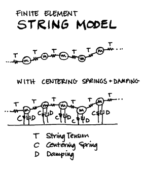
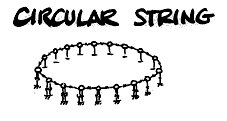

# **Scanned Synthesis**

Scanned synthesis is a variant of physical modeling, where a network of masses connected by springs is used to generate a dynamic waveform. Developed by Bill Verplank, Rob Shaw, and Max Mathews between 1998 and 1999 at Interval Research, Inc. it is based on the psychoacoustics of how we hear and appreciate timbres and on our motor control (haptic) abilities to manipulate timbres during live performance.

Scanned Synthesis involves a slow dynamic system whose frequencies of vibration are below about 15 Hz. The ear cannot hear the low frequencies of the dynamic system. So, to make audible frequencies, the "shape" of the dynamic system, along a closed path, is scanned periodically. The "shape" is converted to a sound wave whose pitch is determined by the speed of the scanning function. Pitch control is completely separate from the dynamic system control. Thus timbre and pitch are independent.

This system can be looked upon as a dynamic wave table. The model can be compared to a slowly vibrating string, or a two dimensional surface obeying the wave equation.

<figure markdown="span">

<figcaption></figcaption>
</figure>

Verplank, Shaw and Mathews studied scanned synthesis chiefly with a finite element model of a generalized string — a collection of masses connected by springs and dampers that can be analyzed with Newton's laws. From there, they generalized a traditional string by adding dampers and springs to each mass.

<figure markdown="span">

<figcaption></figcaption>
</figure>

All parameters — mass (in the drawing above: M), damping (D), earth-spring strength (C), and string tension (T) can vary along the "string." The model is manipulated by pushing or hitting different masses (the individual samples in a very short wavetable) and by manipulating parameters. What is unique here is that the wavetable itself is a dynamic model.

<figure markdown="span">

<figcaption></figcaption>
</figure>

> :memo: **Note**
>
> The term 'hammer' is chosen for the model name, but 'hammer' might not be the best metaphor. A hammer implies that you are striking it - but you are actually initializing a deformation of the surface and then setting it in motion.

You are manipulating the mechanical model at haptic rates 0-10 Hz, and independent to this, you are scanning out the wavetable at the pitch frequency. Although, the table has its own dynamics, there are no discontinuities because the model is implemented as a circular string, so you end up with a looping oscillator (for example of 128 points) with a constantly evolving loop. It is hard to believe, but true, that what results is a short sample that is animated and harmonically rich because of the complex interactive nature of the elements in the underlying system — the mechanics of the model.

<figure markdown="span">

<figcaption></figcaption>
</figure>

In fact, even enveloping can come directly from the model. It turns out that the specific setting of the centering springs can affect the damping of the system — low values allowing the rich timbre to ring, high values causing the tone to die away quickly.

The opcodes [scanu](../../opcodes/scanu) / [scanu2](../../opcodes/scanu2) define the mass/spring network and sets it in motion. The opcode [scans](../../opcodes/scans) follows a predefined path (trajectory) around the network and outputs the detected waveform. Several _scans_ instances may follow different paths around the same network. These are highly efficient mechanical modelling algorithms for both synthesis and sonic animation via algorithmic processing. They should run in real-time. Thus, the output is useful either directly as audio, or as controller values for other parameters.

The Csound implementation adds support for a scanning path or matrix.  Essentially, this offers the possibility of reconnecting the masses in different orders, causing the signal to propagate quite differently. They do not necessarily need to be connected to their direct neighbors. Essentially, the matrix has the effect of &#8220;molding&#8221; this surface into a radically different shape.

Two different matrix formats are available: a binary matrix and a text matrix. It is good practise to give the binary matrix name the extension .matrxB and the text matrix .matrxT. To produce the matrices, the table formats are straightforward.

As an example for the binary matrix, for 4 masses we have the following grid describing the possible connections:

| | | | | |
|-|-|-|-|-|
| |1|2|3|4|
|1| | | | |
|2| | | | |
|3| | | | |
|4| | | | |

Whenever two masses are connected, the point they define is 1. If two masses are not connected, then the point they define is 0. For example, a unidirectional string has the following connections: (1,2), (2,3), (3,4). If it is bidirectional, it also has (2,1), (3,2), (4,3).  For the unidirectional string, the matrix appears:

| | | | | |
|-|-|-|-|-|
| |1|2|3|4|
|1|0|1|0|0|
|2|0|0|1|0|
|3|0|0|0|1|
|4|0|0|0|0|

The above table format of the connection matrix is for conceptual convenience only. The actual values shown in te table are obtained by _scans_ from an ASCII file using [GEN23](../../scoregens/gen23). The actual ASCII file is created from the table model row by row. Therefore the ASCII file for the example table shown above becomes:

```
0100001000010000
```

As an example of a text matrix (see [GEN44](../../scoregens/gen44)), for the same 4 masses we have the following grid describing these connections:

```
<MATRIX size=4>
1   2   4
2   3   2
3   4   6
</MATRIX>
```

Here, the first two values in the row denote a connection from the first to the second. The third number is a weight; a weight of 2 is like having two links so more information gets distributed, while a zero weight means no link. If this third number is omitted it is taken as value 1.

Both these matrix examples are very small and simple. In practice, most scanned synthesis instruments will use many more masses than four, so their matrices will be much larger and more complex. See the example in the [scans](../../opcodes/scans) documentation.

Here is an example that compares the binary and the text matrix. They sound the same. It uses the file [matrices_compare.csd](../../examples/matrices_compare.csd).

``` csound-csd title="Example comparing the use of the binary and the text matrix." linenums="1"
--8<-- "examples/matrices_compare.csd"
```

Please note that generated dynamic wavetables can be very unstable. Certain values for masses, centering, and damping can cause the system to &#8220;blow up&#8221; and the most interesting sounds to emerge from your loudspeakers!

A tutorial, examples, and other information on scanned synthesis is available from the Scanned Synthesis page at [cSounds.com](http://www.csounds.com/scanned/toot/index.html).

Opcodes that implement scanned synthesis are:

* [scanhammer](../../opcodes/scanhammer)
* [scans](../../opcodes/scans)
* [scantable](../../opcodes/scantable)
* [scanu](../../opcodes/scanu)
* [scanu2](../../opcodes/scanu2)
* [scanmap](../../opcodes/scanmap)
* [scansmap](../../opcodes/scansmap)
* [GEN44](../../scoregens/gen44)
